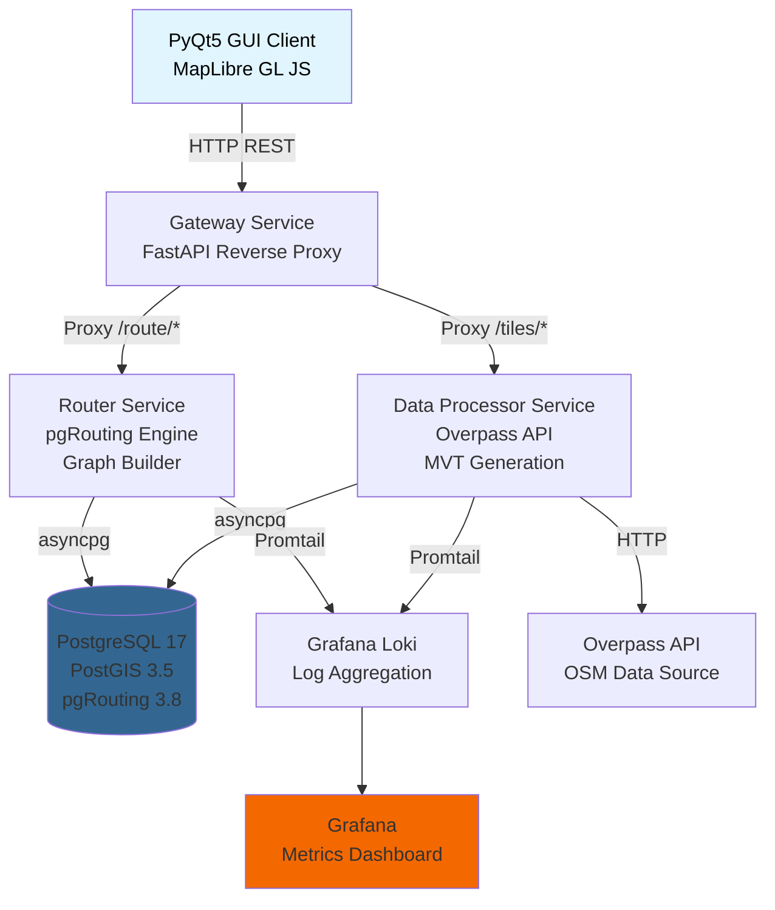

# 2 ИССЛЕДОВАНИЕ ДАННЫХ OPENSTREETMAP И МЕТОДОВ ВИЗУАЛИЗАЦИИ

## 2.1 Анализ структуры данных и ключевых тегов дорожной сети

OpenStreetMap представляет собой открытую краудсорсинговую базу геопространственных данных, поддерживаемую глобальным сообществом картографов. Данные OSM структурированы в виде трёх основных типов примитивов: **nodes** (точечные объекты), **ways** (линейные и полигональные объекты), **relations** (связи между объектами). Дорожная сеть представлена преимущественно примитивами типа `way` с набором тегов, описывающих характеристики дорожного сегмента.

### 2.1.1 Классификация дорог по тегу highway

Основным классификатором дорожных объектов является тег `highway`, определяющий тип дороги. В рамках исследования были проанализированы следующие категории (в порядке убывания значимости для маршрутизации):

**Таблица 1 — Классификация дорог OSM по тегу highway**

| Значение highway | Описание | Скорость по умолчанию, км/ч | Приоритет для маршрутизации |
|---|---|---|---|
| `motorway` | Автомагистраль (скоростная дорога) | 110 | Высокий |
| `trunk` | Загородная, скоростная автодорога, МКАД | 90 | Высокий |
| `primary` | Шоссе внутри МКАД | 80 | Высокий |
| `secondary` | Второстепенная дорога, примыкающая | 60 | Средний |
| `tertiary` | Дорога третьего класса | 60 | Средний |
| `unclassified` | Неклассифицированная дорога | 20 | Низкий |
| `residential` | Жилая зона | 20 | Низкий |
| `service` | Подъездная дорога, парковка | 20 | Минимальный |

Данная классификация была зафиксирована в конфигурационном файле `configs/router_config.yaml` в секции `default_speeds`. При отсутствии явного тега `maxspeed` в исходных данных OSM система использует скоростные режимы из данной таблицы для расчёта времени прохождения участка.

### 2.1.2 Критически важные теги для маршрутизации

В процессе анализа структуры данных OSM был выявлен минимальный набор тегов, необходимых для построения корректного графа маршрутизации:

**1. Теги направленности движения**
- `oneway=yes` — односторонний участок (движение разрешено только в направлении оцифровки геометрии way)
- `oneway=-1` — обратное одностороннее движение
- `oneway=no` — двустороннее движение (по умолчанию для большинства типов дорог)

Для категории `motorway` и `motorway_link` значение `oneway=yes` принимается по умолчанию даже при отсутствии явного тега, что соответствует правилам дорожного движения для автомагистралей.

**2. Теги ограничения доступа**
- `access` — общий доступ к участку (`yes`, `no`, `private`, `permissive`)
- `motor_vehicle` — доступ для моторных транспортных средств (`yes`, `no`, `private`)
- `vehicle` — доступ для всех видов транспорта
- `foot` — доступ для пешеходов

При наличии тега `access=private` или `motor_vehicle=no` участок исключается из графа маршрутизации для автотранспорта. Данная логика реализована в функции `_is_routable(highway, tags)` модуля `services/router/src/graph/graph_builder.py`.

**3. Теги физических характеристик**
- `lanes` — количество полос движения (integer)
- `maxspeed` — ограничение скорости (`50`, `80 km/h`, `90 mph`, `RU:urban`)
- `surface` — тип покрытия (`paved`, `asphalt`, `concrete`, `gravel`, `unpaved`)
- `width` — ширина проезжей части (метры)

Количество полос используется для расчёта пропускной способности участка. При отсутствии тега `lanes` принимается значение по умолчанию: 1 для категорий `service`, `residential`, `unclassified`; 2 для `tertiary` и выше.

**4. Теги дорожных сооружений**
- `bridge=yes` — мостовое сооружение
- `tunnel=yes` — тоннель
- `layer` — относительная высота объекта (используется для разрешения пересечений мостов/тоннелей)

При наличии тегов `bridge` или `tunnel` система не создаёт узлы пересечений с другими дорогами, проходящими на том же участке, если значения `layer` различаются.

**5. Специфичные теги ограничений**
- `barrier` — тип барьера (`gate`, `lift_gate`, `bollard`, `block`)
- `noexit=yes` — тупиковый участок
- `motorcar=no` — запрет проезда для легковых автомобилей

Наличие барьера фиксируется в таблице `osm.barriers` и учитывается при построении графа добавлением временной задержки (penalty) к стоимости прохождения узла.

### 2.1.3 Структура хранения OSM-данных в PostgreSQL

Для хранения данных OSM была спроектирована схема `osm` с следующими таблицами (см. таблицу 2).

**Таблица 2 — Структура схемы osm в PostgreSQL**

| Таблица | Назначение | Ключевые поля |
|---|---|---|
| `osm.ways` | Дорожные пути | `osm_id BIGINT`, <br/>`geom GEOMETRY(LineString,4326)`, <br/>`tags JSONB`,<br/> `highway VARCHAR`,<br/> `oneway TEXT`,<br/> `maxspeed VARCHAR` |
| `osm.nodes` | Узлы OSM (точки) | `osm_id BIGINT`,<br/> `geom GEOMETRY(Point,4326)`,<br/> `tags JSONB` |
| `osm.barriers` | Барьеры на дорогах | `osm_id BIGINT`,<br/> `geom GEOMETRY(Point,4326)`,<br/> `barrier VARCHAR`,<br/> `tags JSONB` |
| `osm.turn_restrictions` | Ограничения поворотов | `osm_id BIGINT`,<br/> `restriction VARCHAR`,<br/> `from_way_id BIGINT`,<br/> `to_way_id BIGINT`,<br/> `via_node_id BIGINT`,<br/> `via_way_id BIGINT` |
| `osm.cached_tiles` | Кэш загруженных тайлов | `tile_key VARCHAR PRIMARY KEY`,<br/> `bbox GEOMETRY(Polygon,4326)`,<br/> `status VARCHAR`,<br/> `downloaded_at TIMESTAMP` |

Геометрические данные хранятся в системе координат WGS84 (EPSG:4326) для совместимости с исходным форматом OSM. Для ускорения пространственных запросов были созданы GiST-индексы на полях `geom`:

```sql
CREATE INDEX idx_osm_ways_geom ON osm.ways USING gist(geom);
CREATE INDEX idx_osm_nodes_geom ON osm.nodes USING gist(geom);
```

Атрибутивные данные тегов OSM хранятся в поле `tags` типа `JSONB` с GIN-индексом для ускорения поиска по тегам:

```sql
CREATE INDEX idx_osm_ways_tags ON osm.ways USING gin(tags);
```

Наиболее часто используемые теги (`highway`, `oneway`, `maxspeed`) вынесены в отдельные столбцы для ускорения фильтрации и построения B-tree индексов.

## 2.2 Разработка стратегии извлечения данных

Overpass API предоставляет язык запросов Overpass QL для выборки данных OSM по географическим и атрибутивным критериям. В процессе исследования был разработан оптимальный запрос для загрузки дорожной сети, включающий все необходимые элементы для построения графа маршрутизации.

### 2.2.1 Структура запроса для загрузки дорожной сети

Базовый запрос для загрузки всех дорожных путей в заданной области:

```overpass
[out:json][timeout:300];
(
  way["highway"]({{bbox}});
);
out geom;
```

Однако данный запрос не включает информацию об ограничениях поворотов (turn restrictions) и барьерах. И вместо стандартного подхода с полной выгрузкой объектов использована стратегия селективной фильтрации с разделением топологии и геометрии. Разработанный запрос, реализованный в модуле services/data-processor/src/handlers/tile_download.py, имеет следующую структуру:

```overpass
[out:json][timeout:{self.timeout}];
(
  // 1. Фильтрация ребер графа по "белому списку" категорий
  way["highway"~"^(motorway|motorway_link|trunk|trunk_link|primary|primary_link|secondary|secondary_link|tertiary|tertiary_link|residential|living_street|unclassified|service|road|track|bus_guideway|escape)$"]({south},{west},{north},{east});
  
  // 2. Извлечение ограничений маневров (Turn Restrictions)
  relation["type"="restriction"]({south},{west},{north},{east});
  
  // 3. Извлечение точечных препятствий (Traffic Calming / Barriers)
  node["barrier"~"gate|boom|bollard|block|wall|lift_gate|sliding_gate"]({south},{west},{north},{east});
  
  // 4. Извлечение сегментов с явными ограничениями доступа
  way["access"="private"]({south},{west},{north},{east});
  way["access"="no"]({south},{west},{north},{east});
  way["motor_vehicle"="no"]({south},{west},{north},{east});
  way["service"="driveway"]({south},{west},{north},{east});
);

// Этап вывода:
out body;  // Вывод метаданных (ID и теги) для найденных ways и relations
>;         // Оператор рекурсии (Recurse down)
out skel qt; // Вывод скелетной геометрии зависимых узлов
```

Параметр `out body qt` обеспечивает вывод полных данных объектов (`body`) с сортировкой по quadtile для оптимизации передачи данных. Параметр `>;` (рекурсивное включение) добавляет все дочерние элементы отношений в результат запроса.

### 2.2.2 Анализ команд оптимизации вывода

Эффективность данного запроса обусловлена использованием специальных директив управления потоком данных:

1. Regex-фильтрация (~"^...$"):
Использование регулярных выражений для ключа highway позволяет одним оператором выбрать только валидные для автомобильной навигации ребра, отсекая пешеходную инфраструктуру (footway, steps, path) на стороне сервера Overpass. Это снижает объем входящего трафика на 40-60% для городских территорий.

2. out body:
Возвращает только идентификаторы и теги для найденных путей и отношений. На этом этапе координаты узлов еще не передаются, что экономит буфер памяти.

3. Оператор рекурсии (>;):
Ключевой элемент запроса. Команда "recurse down" автоматически находит все узлы (nodes), на которые ссылаются выбранные выше пути (ways) и отношения (relations). Это гарантирует ссылочную целостность топологии: мы не получим ребро, ссылающееся на несуществующий узел.

4. out skel qt. Команда вывода для узлов, найденных рекурсией:

    - skel (skeleton): Выводит только ID и координаты ($lat, lon$). Теги узлов (кроме тех, что были запрошены явно в пункте 3, например barrier) подавляются. Это критическая оптимизация: нам не нужны теги created_by или source для миллионов промежуточных узлов геометрии.

    - qt (quadtile sort): Сортирует вывод по индексу квадродерева (пространственная близость). Это значительно ускоряет последующую вставку данных в PostGIS, так как узлы, близкие географически, поступают в базу блоками, уменьшая количество перестроений R-tree индекса при записи (COPY операции).
    
### 2.2.2 Обработка ответов Overpass API

Ответ Overpass API представлен в формате JSON следующей структуры:

```json
{
  "version": 0.6,
  "elements": [
    {
      "type": "way",
      "id": 123456789,
      "nodes": [1001, 1002, 1003, ...],
      "tags": {
        "highway": "residential",
        "name": "Улица Ленина",
        "oneway": "yes",
        "maxspeed": "60",
        "lanes": "2"
      },
      "geometry": [
        {"lat": 55.7558, "lon": 37.6173},
        {"lat": 55.7559, "lon": 37.6175},
        ...
      ]
    },
    ...
  ]
}
```

Поле `geometry` присутствует только при использовании параметра `out geom` и содержит координаты всех точек, составляющих геометрию объекта. Это позволяет избежать необходимости выполнения дополнительных запросов для получения координат узлов.

Обработка ответа выполняется функцией `_process_elements()` в классе `TileDownloadHandler`:

```python
async def _process_elements(self, elements: List[dict]) -> Dict[str, int]:
    """Process OSM elements and store to database."""
    ways_data = []
    nodes_data = []
    barriers_data = []
    
    for element in elements:
        if element["type"] == "way" and "highway" in element.get("tags", {}):
            # Construct LineString from geometry
            coords = [(p["lon"], p["lat"]) for p in element.get("geometry", [])]
            if len(coords) < 2:
                continue
            
            linestring_wkt = f"LINESTRING({', '.join(f'{lon} {lat}' for lon, lat in coords)})"
            
            ways_data.append({
                "osm_id": element["id"],
                "geom": linestring_wkt,
                "tags": json.dumps(element.get("tags", {})),
                "highway": element["tags"].get("highway"),
                "name": element["tags"].get("name"),
                # ... остальные поля
            })
```

### 2.2.3 Оптимизация запросов и ограничения API

Overpass API накладывает следующие ограничения:
- Таймаут запроса: по умолчанию 180 секунд (указывается параметром `[timeout:300]`)
- Ограничение размера ответа: ~512 МБ (для публичных серверов)
- Rate limiting: максимум 2 одновременных запроса с одного IP

Для обхода данных ограничений была реализована система резервных серверов, определённая в конфигурации:

```python
OVERPASS_SERVERS = [
    "https://overpass-api.de/api/interpreter",
    "https://overpass.kumi.systems/api/interpreter",
    "https://overpass.openstreetmap.ru/api/interpreter"
]
```

При получении HTTP 429 (Too Many Requests) или таймауте запрос автоматически повторяется на альтернативном сервере. Логика реализована в методе `_execute_overpass_query()`:

```python
for server_url in self.overpass_servers:
    try:
        response = await self.http_client.post(
            server_url,
            data=query,
            timeout=self.timeout
        )
        if response.status_code == 200:
            return response.json()
        elif response.status_code == 429:
            logger.warning(f"Rate limit on {server_url}, trying next")
            continue
    except httpx.TimeoutException:
        logger.warning(f"Timeout on {server_url}, trying next")
        continue

raise OverpassAPIError("All Overpass servers failed")
```

## 2.3 Обоснование выбора формата векторных тайлов для рендеринга

Для визуализации дорожной сети в графическом клиенте требовалось выбрать формат представления геопространственных данных, удовлетворяющий следующим критериям:
1. Компактность передачи по сети (минимизация объёма трафика)
2. Возможность динамического рендеринга на стороне клиента (изменение стилей без перезагрузки данных)
3. Поддержка произвольного масштабирования без потери качества
4. Возможность аппаратного ускорения средствами GPU

Были рассмотрены следующие варианты:

### 2.3.1 Сравнительный анализ форматов тайлов

**Таблица 3 — Сравнение форматов тайлов для визуализации**

| Формат | Тип данных | Размер тайла z=14 | Рендеринг | Стилизация | Масштабирование |
|---|---|---|---|---|---|
| PNG (растр) | Растровое изображение | ~50 КБ | Серверный | Фиксированная | Пикселизация при zoom |
| GeoJSON | Текстовый JSON | ~300 КБ | Клиентский | Динамическая | Векторное (плавное) |
| MVT (Mapbox) | Бинарный Protobuf | ~80 КБ | Клиентский (WebGL) | Динамическая | Векторное (плавное) |

**Недостатки растровых тайлов**:
- Требуется предварительный рендеринг для каждого уровня масштабирования (z0-z22) и стиля отображения
- Объём хранилища: ~100 ГБ для полного набора тайлов региона москва_mkad
- Невозможность динамической стилизации на клиенте (для изменения цвета дорог требуется перегенерация тайлов)
- Пикселизация при промежуточных уровнях масштабирования

**Недостатки GeoJSON**:
- Текстовый формат с избыточностью (координаты хранятся как строки чисел с плавающей точкой)
- Отсутствие встроенной упрощения геометрии по уровням масштабирования
- Высокая нагрузка на клиента при рендеринге большого количества объектов (>10000 дорожных сегментов)

**Преимущества MVT**:
- Бинарный формат Protocol Buffers обеспечивает компактность (в 3-4 раза меньше GeoJSON)
- Встроенная поддержка упрощения геометрии и фильтрации объектов по уровню масштабирования
- Аппаратное ускорение рендеринга средствами WebGL (библиотека MapLibre GL JS)
- Поддержка динамической стилизации через JSON-конфигурацию стилей
- Стандартизованный формат (Mapbox Vector Tile Specification v2.1)

На основании данного анализа был выбран формат MVT для визуализации дорожной сети.

### 2.3.2 Генерация MVT средствами PostGIS

PostGIS предоставляет встроенную функцию `ST_AsMVT()` для генерации векторных тайлов непосредственно из геометрических данных. Типичный запрос для генерации тайла уровня z=14, координаты (x, y):

```sql
WITH tile_bounds AS (
    SELECT ST_TileEnvelope(14, 9326, 5084) AS geom
),
filtered_ways AS (
    SELECT
        e.id,
        e.highway,
        e.name,
        e.oneway,
        ST_AsMVTGeom(
            e.geom,
            (SELECT geom FROM tile_bounds),
            4096,  -- extent (разрешение тайла)
            256,   -- buffer (расширение границ)
            true   -- clip_geom (обрезать выходящую геометрию)
        ) AS geom
    FROM graphs.edges e
    WHERE e.geom && (SELECT geom FROM tile_bounds)
      AND e.highway IN ('motorway', 'trunk', 'primary', 'secondary', 
                        'tertiary', 'residential', 'service')
)
SELECT ST_AsMVT(filtered_ways.*, 'roads', 4096, 'geom') AS tile
FROM filtered_ways
WHERE geom IS NOT NULL;
```

Функция `ST_TileEnvelope(z, x, y)` вычисляет географический ограничивающий прямоугольник тайла по стандарту TMS (Tile Map Service). Функция `ST_AsMVTGeom()` выполняет преобразование геометрии из системы координат WGS84 в систему координат тайла (локальная система 0-4096), упрощение геометрии и обрезку выходящих за границы тайла участков.

Результат запроса — бинарные данные в формате Protocol Buffers, готовые для передачи клиенту по HTTP с заголовком `Content-Type: application/x-protobuf`.

### 2.3.3 Многоуровневая детализация (LOD)

Для оптимизации производительности рендеринга была реализована система уровней детализации (Level of Detail), при которой на низких уровнях масштабирования (z=0-10) отображаются только магистрали, а на высоких уровнях (z=14+) — полная дорожная сеть.

**Таблица 4 — Уровни детализации дорожной сети**

| Диапазон zoom | Категории highway | Примерный масштаб | Количество объектов в тайле |
|---|---|---|---|
| z=0-9 | `motorway`, `trunk` | 1:500 000 — 1:100 000 | ~50 |
| z=10-13 | + `primary`, `secondary` | 1:50 000 — 1:10 000 | ~200 |
| z=14-18 | + `tertiary`, `residential` | 1:5 000 — 1:1 000 | ~1000 |
| z=19-22 | + `service`, пешеходные пути | 1:500 — 1:100 | ~5000 |

Данная фильтрация реализована в SQL-запросе генерации тайла через условие `WHERE` с динамическим списком категорий highway в зависимости от уровня масштабирования.

## 2.4 Выбор и обоснование технологического стека

Архитектура системы основана на микросервисном подходе с разделением на независимые компоненты, взаимодействующие по HTTP REST API. Выбор технологического стека обусловлен следующими требованиями:

### 2.4.1 Серверные компоненты

**PostgreSQL 17 + PostGIS 3.5 + pgRouting 3.8**

PostgreSQL выбран в качестве основной СУБД благодаря следующим преимуществам:
- Расширение PostGIS предоставляет полный набор функций пространственного анализа (более 400 функций: ST_Intersection, ST_Buffer, ST_Within, ST_DWithin и др.)
- Расширение pgRouting реализует графовые алгоритмы маршрутизации (Dijkstra, A*, k-shortest paths, Turn Restricted Shortest Path)
- Встроенная поддержка GiST-индексов для ускорения пространственных запросов
- MVCC (Multi-Version Concurrency Control) обеспечивает высокую производительность при одновременных чтениях/записях
- Поддержка JSONB для хранения нестандартизированных атрибутов OSM

Версия PostgreSQL 17 выбрана для поддержки новых возможностей генерируемых столбцов (GENERATED ALWAYS AS) для автоматического пересчёта стоимости рёбер графа.

**FastAPI (Python 3.11)**

FastAPI выбран в качестве фреймворка для реализации REST API микросервисов благодаря:
- Нативная поддержка асинхронного программирования (async/await)
- Автоматическая генерация OpenAPI документации
- Валидация входных данных средствами Pydantic
- Высокая производительность (сравнимая с Node.js и Go благодаря uvicorn/uvloop)

Асинхронные возможности FastAPI критичны для неблокирующей работы с PostgreSQL (библиотека asyncpg) и Overpass API (библиотека httpx).

**Docker + Docker Compose**

Контейнеризация обеспечивает:
- Изоляцию зависимостей сервисов
- Воспроизводимость окружения (development = production)
- Упрощение развёртывания (один файл docker-compose.yml)
- Возможность горизонтального масштабирования (docker compose up --scale router=3)

### 2.4.2 Клиентские компоненты

**PyQt5 + QWebEngineView**

Выбор PyQt5 для графического клиента обусловлен:
- Нативный вид приложения (не Electron с огромным footprint)
- Интеграция с Chromium через QWebEngineView для встраивания веб-карты
- Возможность запуска без браузера (standalone приложение)

**MapLibre GL JS**

Библиотека MapLibre GL JS (форк Mapbox GL JS с открытой лицензией BSD-3) выбрана для рендеринга карты благодаря:
- Нативная поддержка формата MVT
- WebGL-рендеринг с аппаратным ускорением (60 FPS при отображении 100k+ объектов)
- Декларативная стилизация через JSON (Mapbox Style Specification)
- API для интерактивных манипуляций (pan, zoom, rotate, pitch)
- Возможность динамического добавления источников данных и слоёв

### 2.4.3 Инфраструктурные компоненты

**Loguru**

Библиотека Loguru выбрана для структурированного логирования благодаря:
- Zero-configuration (работает из коробки без настройки)
- Автоматическая сериализация в JSON для машинного разбора
- Lazy evaluation для минимизации overhead (`logger.opt(lazy=True)`)
- Цветной вывод в консоль для удобства отладки

**Grafana Loki + Promtail**

Стек Grafana Loki выбран для агрегации логов и визуализации метрик:
- Индексация только меток (labels), а не полного текста логов (низкие требования к хранилищу)
- Язык запросов LogQL аналогичен PromQL (единообразие с мониторингом метрик)
- Нативная интеграция с Grafana для построения дашбордов

Альтернативы (ELK Stack, Splunk) отвергнуты из-за высокой сложности настройки и требований к ресурсам.

**Архитектура компонентов**

Общая архитектура системы изображена на рисунке 1.



**Рисунок 1 — Архитектура программного комплекса**

Клиент взаимодействует с серверными компонентами через единую точку входа (Gateway), который маршрутизирует запросы к соответствующим микросервисам. Все сервисы логируют события в Loki через агент Promtail, обеспечивая централизованный мониторинг работы системы.

Данная архитектура обеспечивает слабую связанность компонентов, возможность независимого масштабирования и замены отдельных модулей без остановки системы.

В следующем разделе приведено детальное описание проектирования схемы базы данных и алгоритмов построения графа дорожной сети.
