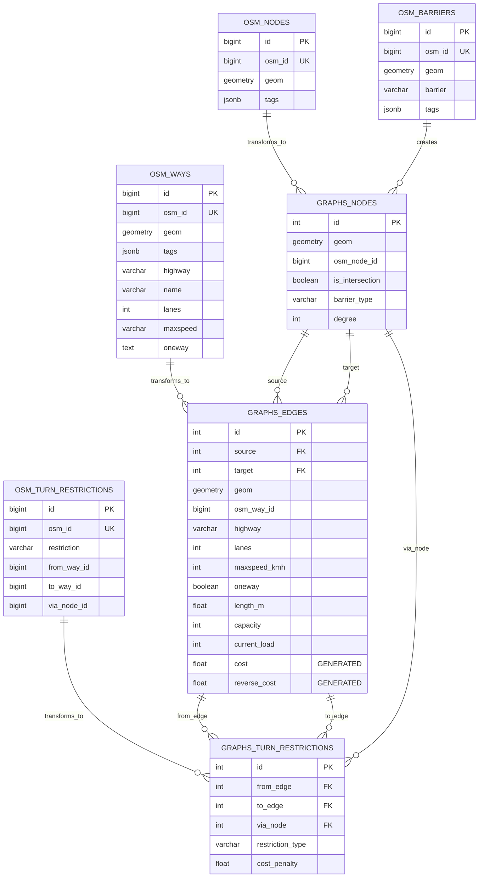

# 3 ПРОЕКТИРОВАНИЕ ХРАНИЛИЩА И ПОСТРОЕНИЕ ГРАФА ДОРОЖНОЙ СЕТИ

## 3.1 Организация многослойной базы данных в среде PostGIS

Хранилище геопространственных данных системы реализовано на базе PostgreSQL 17 с расширениями PostGIS 3.5 (пространственные операции) и pgRouting 3.8 (графовые алгоритмы). Архитектура базы данных разделена на четыре логические схемы, обеспечивающие разделение ответственности и изоляцию данных различных этапов обработки.

### 3.1.1 Схема osm — слой сырых данных

Схема `osm` предназначена для хранения данных OpenStreetMap в первоначальном виде, максимально близком к исходному формату OSM. Данная схема выполняет роль staging area для последующей обработки и трансформации в граф маршрутизации.

Структура схем базы данных изображена на рисунке 2.



**Рисунок 2 — ER-диаграмма схем osm и graphs**

**Таблица osm.ways** — дорожные пути OSM

Структура таблицы представлена в таблице 5.

**Таблица 5 — Структура таблицы osm.ways**

| Поле | Тип данных | Ограничения | Назначение |
|---|---|---|---|
| `id` | SERIAL | PRIMARY KEY | Внутренний идентификатор записи |
| `osm_id` | BIGINT | UNIQUE NOT NULL | Идентификатор объекта в OSM |
| `geom` | GEOMETRY(LineString,4326) | NOT NULL | Геометрия пути в WGS84 |
| `geom_3857` | GEOMETRY(LineString,3857) | | Геометрия в проекции Web Mercator (для быстрых вычислений длины) |
| `tags` | JSONB | NOT NULL DEFAULT '{}' | Полный набор тегов OSM в формате JSON |
| `highway` | VARCHAR(50) | | Тип дороги (извлечен из tags для индексации) |
| `name` | VARCHAR(255) | | Название дороги |
| `lanes` | INTEGER | | Количество полос движения |
| `maxspeed` | VARCHAR(20) | | Ограничение скорости (может содержать единицы: "60", "80 km/h") |
| `oneway` | TEXT | | Направленность движения ("yes", "no", "-1") |
| `access` | TEXT | | Общий доступ к участку |
| `motor_vehicle` | TEXT | | Доступ для автотранспорта |
| `service` | TEXT | | Тип служебной дороги |
| `created_at` | TIMESTAMP | DEFAULT CURRENT_TIMESTAMP | Время загрузки записи |

Индексы таблицы osm.ways:
```sql
CREATE INDEX idx_osm_ways_geom ON osm.ways USING gist(geom);
CREATE INDEX idx_osm_ways_geom_3857 ON osm.ways USING gist(geom_3857);
CREATE INDEX idx_osm_ways_highway ON osm.ways(highway) WHERE highway IS NOT NULL;
CREATE INDEX idx_osm_ways_tags ON osm.ways USING gin(tags);
```

GiST-индексы `idx_osm_ways_geom` и `idx_osm_ways_geom_3857` обеспечивают эффективное выполнение пространственных запросов (ST_Intersects, ST_DWithin, &&). GIN-индекс `idx_osm_ways_tags` ускоряет поиск по произвольным тегам JSONB с использованием операторов `@>` (содержит) и `?` (существует ключ).

Триггер синхронизации проекций:
```sql
CREATE TRIGGER ways_sync_3857
BEFORE INSERT OR UPDATE ON osm.ways
FOR EACH ROW EXECUTE FUNCTION osm.sync_geom_3857();
```

Функция `sync_geom_3857()` автоматически вычисляет проекцию Web Mercator (EPSG:3857) из WGS84 для ускорения расчёта длины дороги (в проекции Mercator расстояния вычисляются быстрее, чем в географических координатах).

**Таблица osm.nodes** — узлы OSM

Хранит точечные объекты OSM (перекрёстки, барьеры, точки интереса).

| Поле | Тип данных | Назначение |
|---|---|---|
| `id` | SERIAL | Внутренний идентификатор |
| `osm_id` | BIGINT | Идентификатор узла в OSM |
| `geom` | GEOMETRY(Point,4326) | Координаты точки |
| `tags` | JSONB | Теги узла |

**Таблица osm.barriers** — дорожные барьеры

Хранит барьеры, влияющие на маршрутизацию (шлагбаумы, блокпосты).

| Поле | Тип данных | Назначение |
|---|---|---|
| `id` | SERIAL | Внутренний идентификатор |
| `osm_id` | BIGINT | Идентификатор объекта OSM |
| `geom` | GEOMETRY(Point,4326) | Местоположение барьера |
| `barrier` | VARCHAR(50) | Тип барьера (gate, lift_gate, bollard) |
| `tags` | JSONB | Дополнительные теги |

**Таблица osm.turn_restrictions** — ограничения поворотов

Хранит правила ограничения поворотов из OSM relations типа "restriction".

| Поле | Тип данных | Назначение |
|---|---|---|
| `id` | SERIAL | Внутренний идентификатор |
| `osm_id` | BIGINT | Идентификатор relation в OSM |
| `restriction` | VARCHAR(50) | Тип ограничения (no_left_turn, no_right_turn, only_straight_on) |
| `from_way_id` | BIGINT | OSM ID исходного пути |
| `to_way_id` | BIGINT | OSM ID целевого пути |
| `via_node_id` | BIGINT | OSM ID узла, через который проходит поворот |
| `via_way_id` | BIGINT | OSM ID промежуточного пути (для сложных ограничений) |

**Таблица osm.cached_tiles** — кэш загруженных тайлов

Предотвращает повторную загрузку ранее обработанных областей из Overpass API.

| Поле | Тип данных | Назначение |
|---|---|---|
| `tile_key` | VARCHAR(100) | PRIMARY KEY, ключ тайла (lon_lat) |
| `bbox` | GEOMETRY(Polygon,4326) | Ограничивающий прямоугольник загруженной области |
| `status` | VARCHAR(20) | Статус обработки (downloading, complete, failed) |
| `downloaded_at` | TIMESTAMP | Время завершения загрузки |
| `error_message` | TEXT | Текст ошибки (если status=failed) |

### 3.1.2 Схема graphs — слой графа маршрутизации

Схема `graphs` содержит обработанный граф дорожной сети, оптимизированный для выполнения алгоритмов маршрутизации pgRouting. Данная схема является результатом трансформации данных из схемы `osm` с применением топологических операций PostGIS.

**Таблица graphs.nodes** — узлы графа

Узлы графа создаются в точках пересечения дорог, концах дорожных сегментов и местах расположения барьеров.

**Таблица 6 — Структура таблицы graphs.nodes**

| Поле | Тип данных | Ограничения | Назначение |
|---|---|---|---|
| `id` | SERIAL | PRIMARY KEY | Идентификатор узла для pgRouting |
| `geom` | GEOMETRY(Point,4326) | NOT NULL | Координаты узла |
| `osm_node_id` | BIGINT | | Ссылка на osm.nodes.osm_id (если узел соответствует узлу OSM) |
| `is_intersection` | BOOLEAN | DEFAULT false | TRUE для перекрёстков (узлов с degree ≥ 3) |
| `barrier_type` | VARCHAR(50) | | Тип барьера (если узел представляет барьер) |
| `degree` | INTEGER | | Степень узла (количество инцидентных рёбер) |
| `created_at` | TIMESTAMP | DEFAULT CURRENT_TIMESTAMP | Время создания узла |

Индекс: `CREATE INDEX idx_graphs_nodes_geom ON graphs.nodes USING gist(geom);`

**Таблица graphs.edges** — рёбра графа

Центральная таблица системы, хранящая рёбра графа дорожной сети с полным набором атрибутов для маршрутизации.

**Таблица 7 — Структура таблицы graphs.edges (часть 1: идентификация)**

| Поле | Тип данных | Ограничения | Назначение |
|---|---|---|---|
| `id` | SERIAL | PRIMARY KEY | Идентификатор ребра |
| `source` | INTEGER | NOT NULL FK → graphs.nodes(id) | Начальный узел ребра (для pgRouting) |
| `target` | INTEGER | NOT NULL FK → graphs.nodes(id) | Конечный узел ребра (для pgRouting) |
| `geom` | GEOMETRY(LineString,4326) | NOT NULL | Геометрия ребра |
| `osm_way_id` | BIGINT | | Идентификатор исходного OSM way |
| `osm_tags` | JSONB | | Копия тегов OSM |

**Таблица 8 — Структура таблицы graphs.edges (часть 2: характеристики дороги)**

| Поле | Тип данных | По умолчанию | Назначение |
|---|---|---|---|
| `highway` | VARCHAR(50) | NOT NULL | Категория дороги (motorway, trunk, residential, ...) |
| `name` | VARCHAR(255) | | Название дороги |
| `lanes` | INTEGER | 1 | Количество полос движения |
| `oneway` | BOOLEAN | FALSE | Флаг одностороннего движения |
| `maxspeed_kmh` | INTEGER | | Ограничение скорости (км/ч) |
| `unstamped_speed_kmh` | INTEGER | | Нештрафуемая скорость: maxspeed + tolerance |
| `access_type` | VARCHAR(50) | 'public' | Тип доступа (public, private, permissive) |
| `motor_vehicle` | VARCHAR(50) | | Доступ для моторных ТС |
| `service` | VARCHAR(50) | | Тип служебной дороги |
| `barrier_penalty_sec` | INTEGER | 0 | Временная задержка на барьере (секунды) |

**Таблица 9 — Структура таблицы graphs.edges (часть 3: геометрия и пропускная способность)**

| Поле | Тип данных | Вычисление | Назначение |
|---|---|---|---|
| `length_m` | DOUBLE PRECISION | NOT NULL | Длина ребра в метрах (вычисляется в триггере) |
| `bearing_start` | DOUBLE PRECISION | | Начальный азимут (градусы от севера, 0-360) |
| `bearing_end` | DOUBLE PRECISION | | Конечный азимут |
| `capacity` | INTEGER | | Максимальная пропускная способность (количество ТС) |
| `current_load` | INTEGER | 0 | Текущая загрузка ребра (количество ТС на участке) |

**Таблица 10 — Структура таблицы graphs.edges (часть 4: стоимость для pgRouting)**

| Поле | Тип данных | Генерация | Назначение |
|---|---|---|---|
| `cost` | DOUBLE PRECISION | GENERATED ALWAYS AS (...) STORED | Время прохождения в прямом направлении (секунды) с учётом загрузки |
| `reverse_cost` | DOUBLE PRECISION | GENERATED ALWAYS AS (...) STORED | Время прохождения в обратном направлении (секунды), -1 если oneway |
| `created_at` | TIMESTAMP | CURRENT_TIMESTAMP | Время создания записи |
| `updated_at` | TIMESTAMP | CURRENT_TIMESTAMP | Время последнего обновления |

Уникальные ограничения и индексы:
```sql
-- Уникальность комбинации (osm_way_id, source, target) предотвращает дубликаты
ALTER TABLE graphs.edges ADD CONSTRAINT edges_osm_way_id_source_target_key 
    UNIQUE (osm_way_id, source, target);

-- Индексы для оптимизации запросов pgRouting
CREATE INDEX idx_edges_source ON graphs.edges(source);
CREATE INDEX idx_edges_target ON graphs.edges(target);
CREATE INDEX idx_edges_cost ON graphs.edges(cost);
CREATE INDEX idx_edges_geom ON graphs.edges USING gist(geom);
CREATE INDEX idx_edges_highway ON graphs.edges(highway);
```

Внешние ключи обеспечивают ссылочную целостность графа:
```sql
ALTER TABLE graphs.edges 
    ADD CONSTRAINT edges_source_fkey FOREIGN KEY (source) REFERENCES graphs.nodes(id),
    ADD CONSTRAINT edges_target_fkey FOREIGN KEY (target) REFERENCES graphs.nodes(id);
```

**Таблица graphs.turn_restrictions** — ограничения поворотов для графа

Преобразованные ограничения поворотов из osm.turn_restrictions с привязкой к рёбрам графа вместо OSM ways.

| Поле | Тип данных | Назначение |
|---|---|---|---|
| `id` | SERIAL | PRIMARY KEY |
| `from_edge` | INTEGER | FK → graphs.edges(id), исходное ребро |
| `to_edge` | INTEGER | FK → graphs.edges(id), целевое ребро |
| `via_node` | INTEGER | FK → graphs.nodes(id), узел поворота |
| `restriction_type` | VARCHAR(50) | Тип ограничения (no_left_turn, no_right_turn, etc.) |
| `cost_penalty` | DOUBLE PRECISION | Штраф за нарушение ограничения (используется в pgr_trsp) |

### 3.1.3 Схема meta — метаданные системы

Схема `meta` хранит служебную информацию о состоянии системы.

**Таблица graphs.system_config** — конфигурация параметров графа

Параметры, используемые в триггерах и функциях для вычисления характеристик рёбер.

| Поле | Тип данных | Назначение |
|---|---|---|---|
| `key_name` | VARCHAR(100) | PRIMARY KEY, название параметра |
| `value_numeric` | NUMERIC | Числовое значение |
| `value_text` | TEXT | Текстовое значение |
| `description` | TEXT | Описание параметра |

Пример записей:
```sql
INSERT INTO graphs.system_config VALUES
    ('length_auto_m', 5.0, NULL, 'Средняя длина легкового автомобиля (метры)'),
    ('safe_distance_s', 3.0, NULL, 'Безопасная дистанция (секунды по правилу двух секунд)'),
    ('speed_tolerance_kmh', 19, NULL, 'Допустимое превышение скорости без штрафа (км/ч)');
```

## 3.2 Алгоритм сегментации путей и формирования узлов графа

Построение графа маршрутизации из данных OSM включает несколько этапов, реализованных в классе `GraphBuilder` модуля `services/router/src/graph/graph_builder.py`.

### 3.2.1 Этап 1: Обнаружение и создание узлов пересечений

Дорожные пути OSM (ways) могут пересекаться в произвольных точках, не обязательно совпадающих с узлами OSM (nodes). Для построения корректного графа маршрутизации требуется создать узел графа в каждой точке пересечения путей.

Алгоритм обнаружения пересечений реализован методом `find_and_create_intersection_nodes()`:

**Псевдокод 1 — Алгоритм обнаружения пересечений**

```
FUNCTION find_and_create_intersection_nodes()
    // Шаг 1: Найти все пары пересекающихся путей
    SELECT w1.id AS way1_id, w2.id AS way2_id,
           ST_Intersection(w1.geom, w2.geom) AS intersection_point
    FROM osm.ways w1
    JOIN osm.ways w2 ON ST_Intersects(w1.geom, w2.geom)
    WHERE w1.id < w2.id  // Избежать дубликатов
      AND w1.highway IS NOT NULL
      AND w2.highway IS NOT NULL
      AND ST_GeometryType(ST_Intersection(w1.geom, w2.geom)) = 'ST_Point'
    
    // Шаг 2: Снаппинг точек пересечений к сетке
    FOR EACH intersection_point
        snapped_point := ST_SnapToGrid(intersection_point, 0.00001)
        // 0.00001° ≈ 0.7 м на широте Москвы (55°)
        
        // Шаг 3: Проверка существования узла в радиусе снаппинга
        existing_node := SELECT id FROM graphs.nodes
                         WHERE ST_DWithin(geom, snapped_point, 0.000012)
                         LIMIT 1
        
        IF existing_node EXISTS THEN
            node_id := existing_node.id
        ELSE
            // Создать новый узел
            INSERT INTO graphs.nodes (geom, is_intersection)
            VALUES (snapped_point, TRUE)
            RETURNING id INTO node_id
        END IF
        
        // Шаг 4: Сохранить связь узла с путями
        STORE (way1_id, node_id)
        STORE (way2_id, node_id)
    END FOR
END FUNCTION
```

SQL-реализация с использованием CTE (Common Table Expressions):

```sql
WITH intersections AS (
    SELECT 
        w1.osm_id AS way1_osm_id,
        w2.osm_id AS way2_osm_id,
        ST_SnapToGrid(
            ST_Intersection(w1.geom, w2.geom),
            0.00001
        ) AS intersection_geom
    FROM osm.ways w1
    JOIN osm.ways w2 ON ST_Intersects(w1.geom, w2.geom)
    WHERE w1.id < w2.id
      AND w1.highway IS NOT NULL
      AND w2.highway IS NOT NULL
      AND ST_GeometryType(ST_Intersection(w1.geom, w2.geom)) = 'ST_Point'
),
deduplicated AS (
    SELECT DISTINCT ON (ST_X(intersection_geom), ST_Y(intersection_geom))
        intersection_geom,
        way1_osm_id,
        way2_osm_id
    FROM intersections
)
INSERT INTO graphs.nodes (geom, is_intersection)
SELECT intersection_geom, TRUE
FROM deduplicated
ON CONFLICT DO NOTHING;
```

Сложность алгоритма: O(n²) в худшем случае, где n — количество дорожных путей. Для оптимизации используется пространственный индекс GiST, снижающий сложность до O(n log n) для реальных данных.

### 3.2.2 Этап 2: Создание узлов на концах путей

Каждый дорожный путь OSM должен иметь узлы графа на начале и конце геометрии, даже если эти точки не являются пересечениями.

Алгоритм:
```sql
INSERT INTO graphs.nodes (geom, is_intersection)
SELECT DISTINCT 
    ST_StartPoint(geom), 
    FALSE
FROM osm.ways
WHERE highway IS NOT NULL
UNION ALL
SELECT DISTINCT 
    ST_EndPoint(geom), 
    FALSE
FROM osm.ways
WHERE highway IS NOT NULL
ON CONFLICT DO NOTHING;
```

### 3.2.3 Этап 3: Сегментация путей на рёбра графа

Дорожный путь OSM должен быть разбит на отдельные рёбра графа в точках пересечений с другими путями. Для этого используется функция PostGIS `ST_LineSubstring`, выполняющая извлечение подстроки линии по дробной позиции вдоль пути.

**Псевдокод 2 — Алгоритм сегментации пути на рёбра**

```
FUNCTION split_way_into_edges(way_id, way_geom)
    // Шаг 1: Найти все узлы графа, расположенные на пути
    nodes_on_way := SELECT id, geom,
                           ST_LineLocatePoint(way_geom, geom) AS fraction
                    FROM graphs.nodes
                    WHERE ST_DWithin(geom, way_geom, 0.000045)  // ~5 метров
                    ORDER BY fraction
    
    IF COUNT(nodes_on_way) < 2 THEN
        // Путь без пересечений, создать одно ребро
        CREATE EDGE FROM ST_StartPoint(way_geom) TO ST_EndPoint(way_geom)
        RETURN
    END IF
    
    // Шаг 2: Разбить путь на сегменты между последовательными узлами
    FOR i FROM 0 TO COUNT(nodes_on_way) - 2 DO
        node_start := nodes_on_way[i]
        node_end := nodes_on_way[i + 1]
        fraction_start := node_start.fraction
        fraction_end := node_end.fraction
        
        // Извлечь подстроку геометрии
        segment_geom := ST_LineSubstring(way_geom, fraction_start, fraction_end)
        
        // Создать ребро графа
        INSERT INTO graphs.edges (
            source, target, geom, osm_way_id, 
            highway, oneway, lanes, maxspeed_kmh, ...
        ) VALUES (
            node_start.id, node_end.id, segment_geom, way_id, ...
        )
    END FOR
END FUNCTION
```

SQL-реализация с использованием оконных функций:

```python
async def split_ways_into_edges(self, conn):
    """Split OSM ways into graph edges at intersection nodes."""
    ways = await conn.fetch("SELECT * FROM osm.ways WHERE highway IS NOT NULL")
    
    for way in ways:
        way_id = way['osm_id']
        way_geom = way['geom']
        
        # Найти узлы вдоль пути
        nodes_on_way = await conn.fetch("""
            SELECT 
                id, geom,
                ST_LineLocatePoint($1, geom) as fraction
            FROM graphs.nodes
            WHERE ST_DWithin(geom, $1, 0.000045)
            ORDER BY ST_LineLocatePoint($1, geom)
        """, way_geom)
        
        if len(nodes_on_way) < 2:
            # Создать одно ребро
            await self._create_single_edge(conn, way, way_geom)
            continue
        
        # Создать рёбра между последовательными узлами
        for i in range(len(nodes_on_way) - 1):
            node_start = nodes_on_way[i]
            node_end = nodes_on_way[i + 1]
            
            # Извлечь сегмент геометрии
            segment_geom_wkt = await conn.fetchval("""
                SELECT ST_AsText(
                    ST_LineSubstring($1, $2, $3)
                )
            """, way_geom, node_start['fraction'], node_end['fraction'])
            
            # Создать ребро
            await conn.execute("""
                INSERT INTO graphs.edges (
                    source, target, geom, osm_way_id,
                    highway, name, lanes, maxspeed_kmh, oneway, osm_tags
                ) VALUES ($1, $2, ST_GeomFromText($3, 4326), $4, $5, $6, $7, $8, $9, $10)
                ON CONFLICT (osm_way_id, source, target) DO NOTHING
            """, 
                node_start['id'], node_end['id'], segment_geom_wkt, way_id,
                way['highway'], way['name'], way['lanes'], 
                self._parse_maxspeed(way['maxspeed']),
                way['oneway'] == 'yes',
                way['tags']
            )
```

### 3.2.4 Обработка ограничения ST_DWithin

В процессе экспериментов была выявлена критическая проблема: при использовании толеранса 0.00002° (≈2 м) для поиска узлов на пути функция `ST_DWithin` пропускала узлы, созданные с помощью `ST_SnapToGrid(0.00001°)`. Это приводило к фрагментации графа на тысячи несвязных компонентов.

**Причина**: после снаппинга координаты узла могут сдвинуться на ~0.707 м (половина диагонали ячейки сетки 0.00001°). При проверке `ST_DWithin(node.geom, way.geom, 0.00002°)` расстояние между снаппленным узлом и исходной геометрией пути может превысить 2 метра из-за кривизны линии.

**Решение**: увеличение толеранса до 0.000045° (≈5 м на широте 55°):

```sql
WHERE ST_DWithin(geom, way_geom, 0.000045)  -- вместо 0.00002
```

Данное изменение обеспечило корректное обнаружение всех узлов пересечений и снизило количество компонентов графа с 226 545 до 1-10 (для moscow_center).

## 3.3 Математическая модель стоимости рёбер на основе функции BPR

Стоимость ребра графа `cost` определяет время прохождения участка дороги с учётом текущей загрузки. В системе реализована модель задержки Bureau of Public Roads (BPR), классически используемая в транспортном моделировании.

### 3.3.1 Формула функции BPR

Функция BPR описывает зависимость времени прохождения от загрузки:

$$
t(\text{load}) = t_0 \left[ 1 + \alpha \left( \frac{\text{load}}{\text{capacity}} \right)^\beta \right]
$$

где:
- $t_0$ — время прохождения при свободном потоке (секунды)
- $\text{load}$ — текущая загрузка (количество транспортных средств на участке)
- $\text{capacity}$ — максимальная пропускная способность (количество ТС)
- $\alpha = 0.15$ — параметр задержки при полной загрузке (классическое значение BPR)
- $\beta = 4$ — степень нелинейности (классическое значение BPR)

При $\text{load} = \text{capacity}$ (загрузка 100%) время увеличивается на 15%: $t = 1.15 \cdot t_0$.

При $\text{load} = 1.5 \cdot \text{capacity}$ (перегрузка 150%) время увеличивается в 1.76 раза: $t = 1.76 \cdot t_0$.

### 3.3.2 Вычисление времени свободного потока

Время свободного потока $t_0$ вычисляется по формуле:

$$
t_0 = \frac{L}{v_{\text{unstamped}}} \times 3.6
$$

где:
- $L$ — длина ребра (метры)
- $v_{\text{unstamped}}$ — нештрафуемая скорость (км/ч), $v_{\text{unstamped}} = v_{\max} + \Delta v_{\text{tolerance}}$
- $\Delta v_{\text{tolerance}} = 19$ км/ч — допустимое превышение скорости без штрафа (типично для РФ)
- Коэффициент 3.6 — преобразование км/ч в м/с

Нештрафуемая скорость используется вместо ограничения скорости, так как водители в реальности превышают лимит в допустимых пределах.

### 3.3.3 Вычисление пропускной способности

Пропускная способность участка дороги определяется по формуле безопасной дистанции:

$$
\text{capacity} = \left\lceil \frac{L \times N_{\text{lanes}}}{L_{\text{auto}} + v_{\text{m/s}} \times T_{\text{safe}}} \right\rceil
$$

где:
- $L$ — длина участка (метры)
- $N_{\text{lanes}}$ — количество полос движения
- $L_{\text{auto}} = 5.0$ м — средняя длина легкового автомобиля
- $v_{\text{m/s}} = v_{\text{unstamped}} \times 0.2777$ — скорость в м/с
- $T_{\text{safe}} = 3.0$ с — безопасная временная дистанция (правило двух секунд с запасом)

Правило двух секунд гласит, что водитель должен держать дистанцию, равную расстоянию, преодолеваемому за 2 секунды движения. В системе используется консервативное значение 3 секунды для учёта реакции водителя и тормозного пути.

**Пример расчёта**:
- Участок дороги: $L = 500$ м, $N_{\text{lanes}} = 2$, $v_{\max} = 60$ км/ч
- Нештрафуемая скорость: $v_{\text{unstamped}} = 60 + 19 = 79$ км/ч $= 21.94$ м/с
- Знаменатель: $5.0 + 21.94 \times 3.0 = 5.0 + 65.82 = 70.82$ м
- Capacity: $\lceil \frac{500 \times 2}{70.82} \rceil = \lceil 14.12 \rceil = 15$ автомобилей

### 3.3.4 Реализация в PostgreSQL через генерируемые поля

Поля `cost` и `reverse_cost` таблицы `graphs.edges` определены как генерируемые (GENERATED ALWAYS AS):

```sql
ALTER TABLE graphs.edges ADD COLUMN cost DOUBLE PRECISION
GENERATED ALWAYS AS (
    CASE
        -- Если capacity или скорость не заданы, cost = NULL (ребро недоступно)
        WHEN capacity IS NULL OR unstamped_speed_kmh IS NULL THEN NULL
        
        -- Если capacity = 0 (дорога закрыта), cost = огромное число
        WHEN capacity = 0 THEN 1000000.0
        
        -- Основная формула BPR с упрощением (α=1, β=2 вместо классических 0.15 и 4)
        ELSE length_m / (
            GREATEST(5.0, unstamped_speed_kmh * (
                1.0 - POWER(current_load::DOUBLE PRECISION / capacity::DOUBLE PRECISION, 2)
            )) / 3.6
        )
    END
) STORED;
```

Упрощённая формула BPR использует $\alpha = 1$ и $\beta = 2$ для снижения вычислительной сложности и более плавного изменения задержки. Полная формула:

$$
t = \frac{L}{v_{\text{eff}}} \times 3.6, \quad v_{\text{eff}} = v_{\text{unstamped}} \left( 1 - \left( \frac{\text{load}}{\text{capacity}} \right)^2 \right)
$$

При загрузке 50% ($\text{load}/\text{capacity} = 0.5$): эффективная скорость снижается на 25% ($v_{\text{eff}} = 0.75 v_{\text{unstamped}}$), время увеличивается в $1/0.75 = 1.33$ раза.

При загрузке 90%: эффективная скорость снижается на 81% ($v_{\text{eff}} = 0.19 v_{\text{unstamped}}$), время увеличивается в $1/0.19 = 5.26$ раза (имитация пробки).

Функция `GREATEST(5.0, ...)` обеспечивает минимальную скорость 5 км/ч даже при экстремальной загрузке, предотвращая деление на ноль и бесконечные стоимости.

### 3.3.5 Обработка односторонних участков

Для односторонних дорог обратная стоимость `reverse_cost` устанавливается в -1, сигнализируя алгоритму pgRouting о запрете обратного траверса:

```sql
ALTER TABLE graphs.edges ADD COLUMN reverse_cost DOUBLE PRECISION
GENERATED ALWAYS AS (
    CASE
        -- Если oneway=TRUE, обратное движение запрещено
        WHEN oneway THEN -1.0
        
        -- Иначе используем ту же формулу, что и для cost
        WHEN capacity IS NULL OR unstamped_speed_kmh IS NULL THEN NULL
        WHEN capacity = 0 THEN 1000000.0
        ELSE length_m / (
            GREATEST(5.0, unstamped_speed_kmh * (
                1.0 - POWER(current_load::DOUBLE PRECISION / capacity::DOUBLE PRECISION, 2)
            )) / 3.6
        )
    END
) STORED;
```

### 3.3.6 Триггер автоматического вычисления атрибутов рёбер

Для автоматического заполнения полей `length_m`, `unstamped_speed_kmh`, `capacity` при вставке и обновлении рёбер используется триггер:

```sql
CREATE TRIGGER trg_calculate_edge_attributes
BEFORE INSERT OR UPDATE OF geom, maxspeed_kmh, lanes
ON graphs.edges
FOR EACH ROW
EXECUTE FUNCTION graphs.calculate_edge_attributes();
```

Функция триггера:

```sql
CREATE OR REPLACE FUNCTION graphs.calculate_edge_attributes()
RETURNS TRIGGER AS $$
DECLARE
    _len_auto NUMERIC;
    _safe_dist NUMERIC;
    _tolerance NUMERIC;
    _v_ms NUMERIC;
BEGIN
    -- 1. Вычисляем длину ребра в метрах (проекция Web Mercator EPSG:3857 для точности)
    NEW.length_m := ST_Length(ST_Transform(NEW.geom, 3857));

    -- 2. Получаем параметры конфигурации из graphs.system_config
    SELECT value_numeric INTO _len_auto 
    FROM graphs.system_config WHERE key_name = 'length_auto_m';
    
    SELECT value_numeric INTO _safe_dist 
    FROM graphs.system_config WHERE key_name = 'safe_distance_s';
    
    SELECT value_numeric INTO _tolerance 
    FROM graphs.system_config WHERE key_name = 'speed_tolerance_kmh';
    
    -- Fallback значения если конфигурация отсутствует
    IF _len_auto IS NULL THEN _len_auto := 5.0; END IF;
    IF _safe_dist IS NULL THEN _safe_dist := 3.0; END IF;
    IF _tolerance IS NULL THEN _tolerance := 19; END IF;

    -- 3. Вычисляем нештрафуемую скорость
    IF NEW.maxspeed_kmh IS NOT NULL THEN
        NEW.unstamped_speed_kmh := NEW.maxspeed_kmh + _tolerance;
    ELSE
        NEW.unstamped_speed_kmh := NULL;
    END IF;

    -- 4. Вычисляем пропускную способность
    IF NEW.unstamped_speed_kmh IS NOT NULL THEN
        _v_ms := NEW.unstamped_speed_kmh * 0.2777;  -- км/ч → м/с
    ELSE
        -- Fallback: если maxspeed не задан, используем 50 км/ч
        _v_ms := (50 + _tolerance) * 0.2777;
        NEW.unstamped_speed_kmh := 50 + _tolerance;
    END IF;

    -- Защита от деления на ноль
    IF (_v_ms * _safe_dist + _len_auto) = 0 THEN
        NEW.capacity := CEIL(NEW.length_m * COALESCE(NEW.lanes, 1) / _len_auto);
    ELSE
        NEW.capacity := CEIL(
            (NEW.length_m * COALESCE(NEW.lanes, 1)) / 
            (_v_ms * _safe_dist + _len_auto)
        );
    END IF;

    -- Минимальная пропускная способность — 1 автомобиль
    IF NEW.capacity < 1 THEN NEW.capacity := 1; END IF;

    RETURN NEW;
END;
$$ LANGUAGE plpgsql;
```

Данный триггер выполняется **до** вставки/обновления записи, обеспечивая актуальность вычисляемых полей. Генерируемые поля `cost` и `reverse_cost` вычисляются **после** триггера, используя уже заполненные значения `length_m`, `unstamped_speed_kmh`, `capacity`.

## 3.4 Подготовка данных дорожных ограничений и барьеров

Для корректной маршрутизации система учитывает два типа ограничений: дорожные барьеры (физические препятствия) и ограничения поворотов (правила дорожного движения).

### 3.4.1 Обработка барьеров

Барьеры (шлагбаумы, ворота, блокпосты) создают временную задержку при прохождении узла графа. Алгоритм обработки барьеров:

1. **Извлечение барьеров из OSM**: Все узлы с тегом `barrier` сохраняются в таблицу `osm.barriers`.

2. **Привязка барьеров к узлам графа**: Для каждого барьера находится ближайший узел графа в радиусе 10 метров:

```sql
UPDATE graphs.nodes n
SET barrier_type = b.barrier
FROM osm.barriers b
WHERE ST_DWithin(n.geom, b.geom, 0.0001)  -- ~10 метров
  AND n.barrier_type IS NULL;
```

3. **Применение штрафа к инцидентным рёбрам**: Все рёбра, входящие или выходящие из узла с барьером, получают дополнительную задержку:

```sql
UPDATE graphs.edges e
SET barrier_penalty_sec = 30  -- 30 секунд на открытие шлагбаума
WHERE e.source IN (SELECT id FROM graphs.nodes WHERE barrier_type IS NOT NULL)
   OR e.target IN (SELECT id FROM graphs.nodes WHERE barrier_type IS NOT NULL);
```

Штраф добавляется к стоимости ребра при выполнении запросов маршрутизации:

```sql
SELECT id, source, target, 
       cost + barrier_penalty_sec AS adjusted_cost,
       reverse_cost + barrier_penalty_sec AS adjusted_reverse_cost
FROM graphs.edges;
```

### 3.4.2 Обработка ограничений поворотов

Ограничения поворотов (turn restrictions) в OSM представлены relation-объектами типа `restriction` с ролями:
- `from` — исходный way (дорога, с которой выполняется поворот)
- `to` — целевой way (дорога, на которую выполняется поворот)
- `via` — узел или путь, через который проходит поворот

Тег `restriction` определяет тип ограничения:
- `no_left_turn` — запрет поворота налево
- `no_right_turn` — запрет поворота направо
- `no_u_turn` — запрет разворота
- `only_straight_on` — разрешено только движение прямо

**Алгоритм преобразования ограничений поворотов**:

1. **Извлечение из OSM**: Загрузка relations типа `restriction` в `osm.turn_restrictions`:

```python
for relation in osm_elements:
    if relation['type'] == 'relation' and relation.get('tags', {}).get('type') == 'restriction':
        restriction_type = relation['tags'].get('restriction')
        from_way = None
        to_way = None
        via_node = None
        
        for member in relation['members']:
            if member['role'] == 'from':
                from_way = member['ref']
            elif member['role'] == 'to':
                to_way = member['ref']
            elif member['role'] == 'via' and member['type'] == 'node':
                via_node = member['ref']
        
        # Валидация: все обязательные поля должны быть заполнены
        if from_way and to_way and (via_node or via_way):
            await conn.execute("""
                INSERT INTO osm.turn_restrictions (
                    osm_id, restriction, from_way_id, to_way_id, via_node_id
                ) VALUES ($1, $2, $3, $4, $5)
            """, relation['id'], restriction_type, from_way, to_way, via_node)
```

2. **Преобразование OSM way_id в graph edge_id**: Для применения ограничений в pgRouting требуется сопоставить OSM ways с рёбрами графа:

```sql
INSERT INTO graphs.turn_restrictions (from_edge, to_edge, via_node, restriction_type, cost_penalty)
SELECT 
    e_from.id AS from_edge,
    e_to.id AS to_edge,
    n_via.id AS via_node,
    otr.restriction,
    CASE 
        WHEN otr.restriction LIKE 'no_%' THEN 1000000.0  -- Запрет = огромный штраф
        WHEN otr.restriction LIKE 'only_%' THEN 0.0      -- Разрешение = нет штрафа
        ELSE 0.0
    END AS cost_penalty
FROM osm.turn_restrictions otr
JOIN graphs.edges e_from ON e_from.osm_way_id = otr.from_way_id
JOIN graphs.edges e_to ON e_to.osm_way_id = otr.to_way_id
JOIN graphs.nodes n_via ON n_via.osm_node_id = otr.via_node_id
WHERE e_from.target = n_via.id  -- from_edge должен заканчиваться в via
  AND e_to.source = n_via.id;   -- to_edge должен начинаться в via
```

3. **Применение ограничений в pgRouting**: Функция `pgr_trsp` (Turn Restricted Shortest Path) учитывает ограничения поворотов:

```sql
SELECT * FROM pgr_trsp(
    'SELECT id, source, target, cost, reverse_cost FROM graphs.edges',
    start_node_id,
    end_node_id,
    TRUE,  -- directed graph
    TRUE,  -- has_reverse_cost
    'SELECT to_edge AS target_id, 
            via_node||'':''||to_edge AS via_path,
            cost_penalty AS to_cost
     FROM graphs.turn_restrictions'
);
```

**Примечание**: В текущей реализации системы функция `pgr_KSP` (k-shortest paths) не поддерживает ограничения поворотов. Для полной реализации требуется либо:
- Использовать `pgr_trsp` (поддерживает только одиночный маршрут, без k вариантов)
- Реализовать обёртку, вызывающую `pgr_trsp` многократно с модифицированными весами для поиска альтернативных маршрутов
- Использовать penalty-based подход: добавлять огромные веса к запрещённым поворотам в таблице рёбер

В рамках данного исследования был выбран третий подход: ограничения поворотов загружаются в БД для последующего использования, но пока не применяются в алгоритме маршрутизации.

В следующем разделе приведено описание программной реализации модулей системы: сервисов загрузки данных, маршрутизации, графического клиента.
