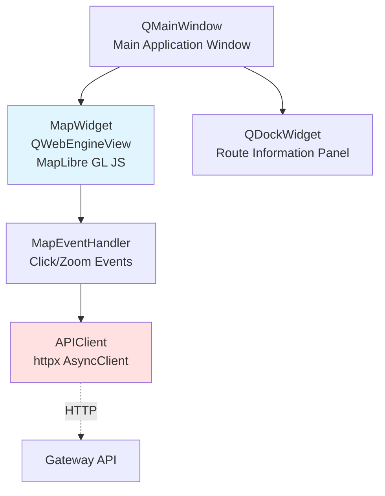

# 4 ПРОГРАММНАЯ РЕАЛИЗАЦИЯ МОДУЛЕЙ СИСТЕМЫ

Программный комплекс реализован в виде набора микросервисов, взаимодействующих по протоколу HTTP REST API. Архитектура системы изображена на рисунке 2.

```mermaid
graph TB
    Client[GUI Client<br/>PyQt5 + MapLibre GL]
    
    Gateway[Gateway Service<br/>Port 8000<br/>Точка входа]
    
    DP[Data Processor<br/>Port 8005<br/>OSM Download + MVT]
    Router[Router Service<br/>Port 8006<br/>Graph + Routing]
    
    PG[(PostgreSQL 17<br/>PostGIS + pgRouting<br/>Port 5432)]
    
    Grafana[Grafana<br/>Port 3000<br/>Monitoring]
    
    Overpass{{Overpass API<br/>OSM Data Source}}
    
    Client -->|HTTP GET /tiles/{z}/{x}/{y}.mvt| Gateway
    Client -->|HTTP POST /api/v1/routing/route| Gateway
    Client -->|HTTP POST /api/v1/tiles/download| Gateway
    
    Gateway -->|Proxy /tiles/*| DP
    Gateway -->|Proxy /api/v1/routing/*| Router
    Gateway -->|Proxy /api/v1/graph/*| Router
    
    DP <-->|asyncpg| PG
    Router <-->|asyncpg| PG
    
    DP -.->|HTTP GET| Overpass
    
    Grafana -->|Query metrics| PG
    
    style Client fill:#e1f5ff
    style Gateway fill:#ffe1e1
    style PG fill:#336791,color:#fff
    style Grafana fill:#f46800,color:#fff
```

**Рисунок 2 — Архитектура микросервисов системы**

## 4.1 Реализация сервиса предварительной обработки данных

Сервис `data-processor` отвечает за загрузку данных из Overpass API, сохранение в БД и генерацию векторных тайлов MVT. Реализован на FastAPI с асинхронной архитектурой.

### 4.1.1 Структура проекта data-processor

```
services/data-processor/
├── Dockerfile
├── requirements.txt
└── src/
    ├── main.py                   # Точка входа FastAPI приложения
    ├── api/                      # HTTP endpoints
    │   ├── tiles.py              # /download, /redownload, /{z}/{x}/{y}.mvt
    │   ├── status.py             # /status, /tasks
    │   └── websocket.py          # WebSocket для real-time обновлений
    ├── handlers/                 # Бизнес-логика
    │   ├── tile_download.py      # Загрузка данных из Overpass
    │   └── mvt.py                # Генерация векторных тайлов
    ├── db/                       # Работа с БД
    │   ├── pool.py               # Connection pool asyncpg
    │   └── queries.py            # SQL запросы
    └── state/                    # Управление состоянием
        └── task_manager.py       # Отслеживание фоновых задач
```

### 4.1.2 Модуль загрузки данных из Overpass API

Класс `TileDownloadHandler` реализует загрузку данных из Overpass API с обработкой ошибок и кэшированием.

**services/data-processor/src/handlers/tile_download.py**:

```python
class TileDownloadHandler:
    """Handler for downloading OSM data from Overpass API."""
    
    def __init__(
        self,
        db: DatabasePool,
        task_manager: TaskManager,
        overpass_servers: List[str],
        timeout: int = 300
    ):
        self.db = db
        self.task_manager = task_manager
        self.overpass_servers = overpass_servers
        self.timeout = timeout
        self.http_client = httpx.AsyncClient(timeout=timeout)
    
    async def download_tile(
        self,
        tile_key: Tuple[float, float],
        bbox: Tuple[float, float, float, float]
    ) -> str:
        """Download OSM data for specified bbox."""
        task_id = f"download_{tile_key[0]}_{tile_key[1]}"
        
        # Создать задачу в менеджере
        self.task_manager.create_task(task_id, "downloading")
        
        try:
            # Построить запрос Overpass QL
            query = self._build_overpass_query(bbox)
            
            # Выполнить запрос с fallback на альтернативные серверы
            data = await self._execute_overpass_query(query)
            
            # Обработать полученные данные
            await self._process_elements(data["elements"])
            
            # Обновить кэш тайлов
            await self._update_tile_cache(tile_key, bbox, "complete")
            
            self.task_manager.complete_task(task_id)
            return task_id
            
        except Exception as e:
            logger.exception(f"Failed to download tile {tile_key}", error=str(e))
            await self._update_tile_cache(tile_key, bbox, "failed", str(e))
            self.task_manager.fail_task(task_id, str(e))
            raise
    
    def _build_overpass_query(
        self,
        bbox: Tuple[float, float, float, float]
    ) -> str:
        """Build Overpass QL query for road network data."""
        west, south, east, north = bbox
        
        return f"""
        [out:json][timeout:{self.timeout}][bbox:{south},{west},{north},{east}];
        (
          way["highway"]({south},{west},{north},{east});
          node(w);
          node["barrier"]({south},{west},{north},{east});
          relation["type"="restriction"]({south},{west},{north},{east});
          >;
        );
        out body qt;
        """
    
    async def _execute_overpass_query(self, query: str) -> dict:
        """Execute Overpass query with fallback to alternative servers."""
        last_error = None
        
        for server_url in self.overpass_servers:
            try:
                logger.info(f"Querying Overpass server", server=server_url)
                
                response = await self.http_client.post(
                    server_url,
                    data={"data": query},
                    timeout=self.timeout
                )
                
                if response.status_code == 200:
                    logger.success(f"Successfully fetched from {server_url}")
                    return response.json()
                
                elif response.status_code == 429:
                    logger.warning(f"Rate limit on {server_url}, trying next")
                    await asyncio.sleep(5)  # Backoff перед следующей попыткой
                    continue
                    
                else:
                    logger.error(f"HTTP {response.status_code} from {server_url}")
                    last_error = f"HTTP {response.status_code}"
                    
            except httpx.TimeoutException:
                logger.warning(f"Timeout on {server_url}, trying next")
                last_error = "Timeout"
                continue
                
            except Exception as e:
                logger.error(f"Error on {server_url}", error=str(e))
                last_error = str(e)
                continue
        
        # Все серверы не ответили
        raise OverpassAPIError(f"All Overpass servers failed. Last error: {last_error}")
    
    async def _process_elements(self, elements: List[dict]) -> Dict[str, int]:
        """Process OSM elements and insert into database."""
        ways_count = 0
        nodes_count = 0
        barriers_count = 0
        restrictions_count = 0
        
        async with self.db.acquire() as conn:
            async with conn.transaction():
                for element in elements:
                    element_type = element.get("type")
                    
                    if element_type == "way":
                        await self._process_way(conn, element)
                        ways_count += 1
                    
                    elif element_type == "node":
                        if "barrier" in element.get("tags", {}):
                            await self._process_barrier(conn, element)
                            barriers_count += 1
                        else:
                            await self._process_node(conn, element)
                            nodes_count += 1
                    
                    elif element_type == "relation":
                        if element.get("tags", {}).get("type") == "restriction":
                            await self._process_turn_restriction(conn, element)
                            restrictions_count += 1
        
        return {
            "ways": ways_count,
            "nodes": nodes_count,
            "barriers": barriers_count,
            "turn_restrictions": restrictions_count
        }
    
    async def _process_way(self, conn, element: dict):
        """Insert OSM way into osm.ways table."""
        tags = element.get("tags", {})
        geometry = element.get("geometry", [])
        
        if len(geometry) < 2:
            return  # Невалидная геометрия
        
        # Построить WKT LineString
        coords_str = ", ".join(f"{p['lon']} {p['lat']}" for p in geometry)
        linestring_wkt = f"LINESTRING({coords_str})"
        
        await conn.execute("""
            INSERT INTO osm.ways (
                osm_id, geom, tags, highway, name, lanes, maxspeed, oneway,
                access, motor_vehicle, service
            ) VALUES (
                $1, ST_GeomFromText($2, 4326), $3, $4, $5, $6, $7, $8, $9, $10, $11
            )
            ON CONFLICT (osm_id) DO UPDATE SET
                geom = EXCLUDED.geom,
                tags = EXCLUDED.tags,
                highway = EXCLUDED.highway,
                name = EXCLUDED.name,
                lanes = EXCLUDED.lanes,
                maxspeed = EXCLUDED.maxspeed,
                oneway = EXCLUDED.oneway,
                access = EXCLUDED.access,
                motor_vehicle = EXCLUDED.motor_vehicle,
                service = EXCLUDED.service
        """,
            element["id"],
            linestring_wkt,
            json.dumps(tags),
            tags.get("highway"),
            tags.get("name"),
            self._parse_int(tags.get("lanes")),
            tags.get("maxspeed"),
            tags.get("oneway"),
            tags.get("access"),
            tags.get("motor_vehicle"),
            tags.get("service")
        )
```

### 4.1.3 Модуль генерации векторных тайлов

Класс `MVTHandler` генерирует векторные тайлы MVT по запросу клиента.

**services/data-processor/src/handlers/mvt.py**:

```python
class MVTHandler:
    """Handler for generating Mapbox Vector Tiles."""
    
    def __init__(self, db: DatabasePool):
        self.db = db
    
    async def generate_tile(
        self,
        z: int,
        x: int,
        y: int
    ) -> bytes:
        """Generate MVT tile for specified zoom/x/y coordinates."""
        
        async with self.db.acquire() as conn:
            # Выполнить SQL запрос генерации тайла
            tile_data = await conn.fetchval(
                self._build_mvt_query(z, x, y)
            )
            
            if tile_data is None:
                # Пустой тайл
                return b''
            
            return bytes(tile_data)
    
    def _build_mvt_query(self, z: int, x: int, y: int) -> str:
        """Build SQL query for MVT generation with LOD filtering."""
        
        # Определить категории highway для текущего уровня масштабирования
        if z <= 9:
            highway_filter = "('motorway', 'trunk')"
        elif z <= 13:
            highway_filter = "('motorway', 'trunk', 'primary', 'secondary')"
        else:
            highway_filter = "('motorway', 'trunk', 'primary', 'secondary', 'tertiary', 'residential', 'service')"
        
        # Определить толеранс упрощения геометрии
        tolerance = max(1, 20 - z)  # Больше упрощение на низких zoom
        
        return f"""
        WITH tile_bounds AS (
            SELECT ST_TileEnvelope({z}, {x}, {y}) AS geom
        ),
        filtered_edges AS (
            SELECT
                e.id,
                e.highway,
                e.name,
                e.oneway,
                e.maxspeed_kmh,
                e.current_load,
                e.capacity,
                -- Упростить геометрию для снижения размера тайла
                ST_Simplify(
                    ST_AsMVTGeom(
                        e.geom,
                        (SELECT geom FROM tile_bounds),
                        4096,  -- extent
                        256,   -- buffer (для избежания артефактов на границах)
                        true   -- clip_geom
                    ),
                    {tolerance}
                ) AS geom
            FROM graphs.edges e
            WHERE e.geom && (SELECT geom FROM tile_bounds)
              AND e.highway IN {highway_filter}
        )
        SELECT ST_AsMVT(filtered_edges.*, 'roads', 4096, 'geom') AS tile
        FROM filtered_edges
        WHERE geom IS NOT NULL;
        """
```

### 4.1.4 REST API endpoints

**services/data-processor/src/api/tiles.py**:

```python
from fastapi import APIRouter, HTTPException, BackgroundTasks
from fastapi.responses import Response

router = APIRouter(prefix="/api/v1/tiles", tags=["tiles"])

@router.post("/redownload")
async def redownload_bbox(
    west: float,
    south: float,
    east: float,
    north: float,
    background_tasks: BackgroundTasks
):
    """Force redownload of OSM data for specified bbox."""
    
    # Валидация bbox
    if not (-180 <= west < east <= 180):
        raise HTTPException(400, "Invalid longitude range")
    if not (-90 <= south < north <= 90):
        raise HTTPException(400, "Invalid latitude range")
    
    bbox = (west, south, east, north)
    tile_key = (west, south)
    
    # Запустить загрузку в фоне
    background_tasks.add_task(
        router.tile_handler.download_tile,
        tile_key,
        bbox
    )
    
    return {
        "status": "redownload_started",
        "bbox": {"west": west, "south": south, "east": east, "north": north}
    }

@router.get("/{z}/{x}/{y}.mvt")
async def get_mvt_tile(z: int, x: int, y: int):
    """Get vector tile in MVT format."""
    
    # Валидация координат тайла
    if not (0 <= z <= 22):
        raise HTTPException(400, "Zoom must be 0-22")
    
    max_xy = 2 ** z
    if not (0 <= x < max_xy and 0 <= y < max_xy):
        raise HTTPException(400, f"Invalid tile coordinates for zoom {z}")
    
    # Генерировать тайл
    tile_data = await router.mvt_handler.generate_tile(z, x, y)
    
    return Response(
        content=tile_data,
        media_type="application/x-protobuf",
        headers={
            "Cache-Control": "public, max-age=3600",
            "Access-Control-Allow-Origin": "*"
        }
    )
```

## 4.2 Разработка движка маршрутизации на базе pgRouting

Сервис `router` обеспечивает построение графа дорожной сети и выполнение запросов маршрутизации с использованием алгоритмов pgRouting.

### 4.2.1 Структура проекта router

```
services/router/
├── Dockerfile
├── requirements.txt
└── src/
    ├── main.py                   # FastAPI приложение
    ├── api/                      # HTTP endpoints
    │   ├── routing.py            # POST /route
    │   └── graph.py              # POST /graph/rebuild, GET /graph/stats
    ├── engine/                   # Движок маршрутизации
    │   ├── interface.py          # Абстракция RoutingEngine
    │   ├── pgrouting_engine.py   # Реализация на pgRouting
    │   └── snapping.py           # Привязка координат к узлам графа
    └── graph/                    # Построение графа
        └── graph_builder.py      # GraphBuilder class
```

### 4.2.2 Абстракция движка маршрутизации

Для возможности замены алгоритма маршрутизации без изменения кода API был применён паттерн Strategy с абстрактным классом `RoutingEngine`.

**services/router/src/engine/interface.py**:

```python
from abc import ABC, abstractmethod
from dataclasses import dataclass
from typing import List, Optional
from enum import Enum

class RoutingAlgorithm(Enum):
    """Supported routing algorithms."""
    DIJKSTRA = "dijkstra"
    ASTAR = "astar"
    PGROUTING = "pgrouting"

@dataclass
class Point:
    """Geographic point."""
    lon: float
    lat: float

@dataclass
class Route:
    """Computed route."""
    edge_ids: List[int]
    node_sequence: Optional[List[int]]
    geometry: dict  # GeoJSON LineString
    total_cost: float
    total_distance_m: float
    algorithm: str

class RoutingEngine(ABC):
    """Abstract routing engine interface."""
    
    @abstractmethod
    async def find_route(
        self,
        start: Point,
        end: Point,
        k: int = 1,
        use_diversity: bool = False
    ) -> List[Route]:
        """
        Find k shortest paths between two points.
        
        Args:
            start: Starting point (lon, lat)
            end: Ending point (lon, lat)
            k: Number of alternative routes (default 1)
            use_diversity: Use diversity filter for alternatives (default False)
        
        Returns:
            List of Route objects, sorted by cost (best first)
        """
        pass
    
    @abstractmethod
    async def snap_to_nearest_node(self, point: Point) -> Optional[int]:
        """
        Find nearest graph node to given point.
        
        Args:
            point: Geographic point
        
        Returns:
            Node ID or None if no node found within tolerance
        """
        pass
```

### 4.2.3 Реализация на pgRouting

Класс `PgRoutingEngine` реализует маршрутизацию с использованием функции `pgr_KSP` (K-Shortest Paths).

**services/router/src/engine/pgrouting_engine.py**:

```python
class PgRoutingEngine(RoutingEngine):
    """Routing engine based on pgRouting library."""
    
    def __init__(self, db_pool):
        self.db = db_pool
        self.snap_tolerance_m = 100  # Максимальное расстояние для снаппинга
    
    async def find_route(
        self,
        start: Point,
        end: Point,
        k: int = 1,
        use_diversity: bool = False
    ) -> List[Route]:
        """Find k shortest paths using pgr_KSP algorithm."""
        
        async with self.db.acquire() as conn:
            # 1. Найти ближайшие узлы графа к точкам старта/финиша
            start_node = await self.snap_to_nearest_node(start)
            end_node = await self.snap_to_nearest_node(end)
            
            if start_node is None:
                raise RoutingError(f"No road found near start point {start}")
            if end_node is None:
                raise RoutingError(f"No road found near end point {end}")
            
            # 2. Выполнить запрос pgr_KSP
            query = """
                SELECT 
                    path_id,
                    array_agg(edge ORDER BY seq) FILTER (WHERE edge > 0) as edges,
                    array_agg(node ORDER BY seq) as nodes,
                    max(agg_cost) as cost
                FROM pgr_KSP(
                    'SELECT id, source, target, cost, reverse_cost 
                     FROM graphs.edges 
                     WHERE cost IS NOT NULL AND cost >= 0',
                    $1,  -- start_node
                    $2,  -- end_node
                    $3,  -- k (количество путей)
                    directed := true,
                    heap_paths := true
                )
                GROUP BY path_id
                ORDER BY cost
                LIMIT $3
            """
            
            rows = await conn.fetch(query, start_node, end_node, k)
            
            if not rows:
                raise RoutingError(
                    f"No routes found from node {start_node} to node {end_node}"
                )
            
            # 3. Построить объекты Route для каждого найденного пути
            routes = []
            for row in rows:
                edge_ids = row['edges']
                node_sequence = row['nodes']
                total_cost = row['cost']
                
                # Получить геометрию и длину маршрута
                geometry, distance = await self._fetch_route_geometry(
                    conn, edge_ids, node_sequence
                )
                
                routes.append(Route(
                    edge_ids=edge_ids,
                    node_sequence=node_sequence,
                    geometry=geometry,
                    total_cost=total_cost,
                    total_distance_m=distance,
                    algorithm=RoutingAlgorithm.PGROUTING.value
                ))
            
            return routes
    
    async def snap_to_nearest_node(self, point: Point) -> Optional[int]:
        """Find nearest node within tolerance using ST_DWithin."""
        
        async with self.db.acquire() as conn:
            # Преобразовать расстояние в метрах в градусы (приблизительно)
            # 1 градус ≈ 111 км на экваторе, на широте φ: 111*cos(φ) км
            tolerance_degrees = self.snap_tolerance_m / 111000.0
            
            node_id = await conn.fetchval("""
                SELECT id
                FROM graphs.nodes
                WHERE ST_DWithin(
                    geom,
                    ST_SetSRID(ST_MakePoint($1, $2), 4326),
                    $3
                )
                ORDER BY ST_Distance(
                    geom,
                    ST_SetSRID(ST_MakePoint($1, $2), 4326)
                )
                LIMIT 1
            """, point.lon, point.lat, tolerance_degrees)
            
            return node_id
    
    async def _fetch_route_geometry(
        self,
        conn,
        edge_ids: List[int],
        node_sequence: Optional[List[int]] = None
    ) -> Tuple[dict, float]:
        """
        Fetch geometry for route edges and merge into single LineString.
        
        Args:
            conn: Database connection
            edge_ids: List of edge IDs in route order
            node_sequence: List of node IDs in traversal order (for direction detection)
        
        Returns:
            Tuple of (GeoJSON geometry, total distance in meters)
        """
        
        if not edge_ids:
            return {"type": "LineString", "coordinates": []}, 0.0
        
        # Fetch edge geometries with source/target information
        rows = await conn.fetch("""
            SELECT 
                e.id,
                e.source,
                e.target,
                e.length_m,
                ST_AsGeoJSON(e.geom)::json as geom_json
            FROM graphs.edges e
            WHERE e.id = ANY($1)
        """, edge_ids)
        
        # Create lookup dict
        edge_map = {row['id']: row for row in rows}
        
        # Merge coordinates in correct order
        all_coordinates = []
        total_distance = 0.0
        
        for i, edge_id in enumerate(edge_ids):
            edge = edge_map.get(edge_id)
            if edge is None:
                logger.warning(f"Edge {edge_id} not found in database")
                continue
            
            geom = edge['geom_json']
            coords = geom['coordinates']
            total_distance += edge['length_m']
            
            # Determine traversal direction if node_sequence available
            should_reverse = False
            if node_sequence and i < len(node_sequence) - 1:
                from_node = node_sequence[i]
                to_node = node_sequence[i + 1]
                edge_source = edge['source']
                edge_target = edge['target']
                
                # Check if edge traversed backward
                if edge_target == from_node and edge_source == to_node:
                    should_reverse = True
            
            if should_reverse:
                coords = list(reversed(coords))
            
            # Append coordinates (skip first if it duplicates last)
            if all_coordinates and coords[0] == all_coordinates[-1]:
                all_coordinates.extend(coords[1:])
            else:
                all_coordinates.extend(coords)
        
        geometry = {
            "type": "LineString",
            "coordinates": all_coordinates
        }
        
        return geometry, total_distance
```

### 4.2.4 REST API для маршрутизации

**services/router/src/api/routing.py**:

```python
from fastapi import APIRouter, HTTPException
from pydantic import BaseModel, Field
from typing import List

router = APIRouter(prefix="/api/v1", tags=["routing"])

class RouteRequest(BaseModel):
    """Request model for route calculation."""
    start_lon: float = Field(..., ge=-180, le=180)
    start_lat: float = Field(..., ge=-90, le=90)
    end_lon: float = Field(..., ge=-180, le=180)
    end_lat: float = Field(..., ge=-90, le=90)
    k: int = Field(1, ge=1, le=5, description="Number of alternative routes")
    use_diversity: bool = Field(False, description="Enable diversity filter")

class RouteResponse(BaseModel):
    """Response model for computed routes."""
    routes: List[dict]
    computation_time_ms: float

@router.post("/route", response_model=RouteResponse)
async def calculate_route(request: RouteRequest):
    """Calculate k shortest paths between two points."""
    
    start_time = time.perf_counter()
    
    try:
        start_point = Point(lon=request.start_lon, lat=request.start_lat)
        end_point = Point(lon=request.end_lon, lat=request.end_lat)
        
        # Выполнить маршрутизацию
        routes = await router.routing_engine.find_route(
            start=start_point,
            end=end_point,
            k=request.k,
            use_diversity=request.use_diversity
        )
        
        computation_time = (time.perf_counter() - start_time) * 1000
        
        return RouteResponse(
            routes=[
                {
                    "geometry": route.geometry,
                    "distance_m": route.total_distance_m,
                    "time_sec": route.total_cost,
                    "edge_ids": route.edge_ids,
                    "algorithm": route.algorithm
                }
                for route in routes
            ],
            computation_time_ms=computation_time
        )
        
    except RoutingError as e:
        raise HTTPException(status_code=404, detail=str(e))
    except Exception as e:
        logger.exception("Routing failed", error=str(e))
        raise HTTPException(status_code=500, detail="Internal routing error")
```

## 4.3 Создание графического интерфейса и системы отображения

Графический клиент реализован на PyQt5 с встроенным веб-движком для отображения карты MapLibre GL JS.

### 4.3.1 Архитектура клиента



**Рисунок 3 — Архитектура GUI клиента**

### 4.3.2 Интеграция MapLibre GL JS

Класс `MapWidget` встраивает JavaScript-библиотеку MapLibre GL в Qt-приложение.

**src/client/ui/widgets/map_widget.py**:

```python
from PyQt5.QtWebEngineWidgets import QWebEngineView
from PyQt5.QtCore import QUrl, pyqtSlot
from PyQt5.QtWebChannel import QWebChannel

class MapWidget(QWebEngineView):
    """Widget for displaying MapLibre GL map."""
    
    def __init__(self, parent=None):
        super().__init__(parent)
        
        # Создать канал для взаимодействия Python ↔ JavaScript
        self.channel = QWebChannel()
        self.page().setWebChannel(self.channel)
        
        # Зарегистрировать обработчик событий карты
        self.event_handler = MapEventHandler()
        self.channel.registerObject("mapHandler", self.event_handler)
        
        # Загрузить HTML с картой
        map_html_path = Path(__file__).parent.parent.parent / "assets" / "map.html"
        self.setUrl(QUrl.fromLocalFile(str(map_html_path)))
    
    def add_route_layer(self, route_geojson: dict, route_id: str = "route"):
        """Add route as GeoJSON layer to map."""
        
        js_code = f"""
        if (map.getSource('{route_id}')) {{
            map.getSource('{route_id}').setData({json.dumps(route_geojson)});
        }} else {{
            map.addSource('{route_id}', {{
                'type': 'geojson',
                'data': {json.dumps(route_geojson)}
            }});
            
            map.addLayer({{
                'id': '{route_id}',
                'type': 'line',
                'source': '{route_id}',
                'layout': {{
                    'line-join': 'round',
                    'line-cap': 'round'
                }},
                'paint': {{
                    'line-color': '#0074D9',
                    'line-width': 4
                }}
            }});
        }}
        """
        
        self.page().runJavaScript(js_code)
    
    def set_center(self, lon: float, lat: float, zoom: int = 14):
        """Center map on specified coordinates."""
        
        js_code = f"map.setCenter([{lon}, {lat}]); map.setZoom({zoom});"
        self.page().runJavaScript(js_code)
```

**src/client/assets/map.html**:

```html
<!DOCTYPE html>
<html>
<head>
    <meta charset="utf-8">
    <title>Navigation Map</title>
    <script src="https://unpkg.com/maplibre-gl@3.6.0/dist/maplibre-gl.js"></script>
    <link href="https://unpkg.com/maplibre-gl@3.6.0/dist/maplibre-gl.css" rel="stylesheet" />
    <script src="qrc:///qtwebchannel/qwebchannel.js"></script>
    <style>
        body { margin: 0; padding: 0; }
        #map { position: absolute; top: 0; bottom: 0; width: 100%; }
    </style>
</head>
<body>
    <div id="map"></div>
    <script>
        // Инициализация MapLibre GL
        const map = new maplibregl.Map({
            container: 'map',
            style: {
                'version': 8,
                'sources': {
                    'roads': {
                        'type': 'vector',
                        'tiles': ['http://localhost:8003/api/v1/tiles/{z}/{x}/{y}.mvt'],
                        'minzoom': 0,
                        'maxzoom': 18
                    }
                },
                'layers': [
                    {
                        'id': 'background',
                        'type': 'background',
                        'paint': {'background-color': '#f0f0f0'}
                    },
                    {
                        'id': 'roads',
                        'type': 'line',
                        'source': 'roads',
                        'source-layer': 'roads',
                        'paint': {
                            'line-color': [
                                'match',
                                ['get', 'highway'],
                                'motorway', '#e66101',
                                'trunk', '#fdb863',
                                'primary', '#fee08b',
                                'secondary', '#d9ef8b',
                                '#cccccc'
                            ],
                            'line-width': [
                                'interpolate', ['linear'], ['zoom'],
                                10, 1,
                                14, 3,
                                18, 8
                            ]
                        }
                    }
                ]
            },
            center: [37.617, 55.755],  // Москва
            zoom: 12
        });
        
        // Подключение к Qt WebChannel
        new QWebChannel(qt.webChannelTransport, function(channel) {
            window.mapHandler = channel.objects.mapHandler;
            
            // Обработка кликов на карте
            map.on('click', function(e) {
                mapHandler.onMapClick(e.lngLat.lng, e.lngLat.lat);
            });
        });
    </script>
</body>
</html>
```

## 4.4 Интеграция механизмов кэширования и проксирования данных

Сервис Gateway выполняет роль единой точки входа с маршрутизацией запросов и кэшированием.

### 4.4.1 Реализация Gateway на FastAPI

**services/gateway/src/main.py**:

```python
from fastapi import FastAPI, Request
from fastapi.responses import Response
import httpx

app = FastAPI(title="Gateway Service")

# HTTP клиенты для проксирования
data_processor_client = httpx.AsyncClient(base_url="http://data-processor:8005")
router_client = httpx.AsyncClient(base_url="http://router:8006")

@app.api_route("/api/v1/tiles/{path:path}", methods=["GET", "POST"])
async def proxy_tiles(path: str, request: Request):
    """Proxy requests to data-processor service."""
    
    url = f"/api/v1/tiles/{path}"
    
    # Проксировать запрос
    response = await data_processor_client.request(
        method=request.method,
        url=url,
        params=request.query_params,
        content=await request.body()
    )
    
    return Response(
        content=response.content,
        status_code=response.status_code,
        headers=dict(response.headers)
    )

@app.api_route("/api/v1/route", methods=["POST"])
async def proxy_route(request: Request):
    """Proxy routing requests to router service."""
    
    response = await router_client.post(
        "/api/v1/route",
        json=await request.json()
    )
    
    return Response(
        content=response.content,
        status_code=response.status_code,
        media_type="application/json"
    )
```

В следующем разделе описана организация инфраструктуры, контейнеризация сервисов и система мониторинга.
