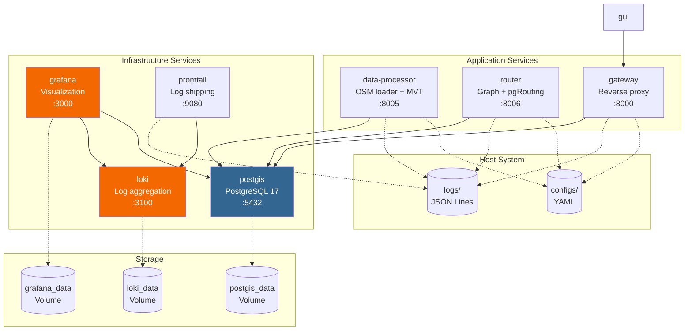
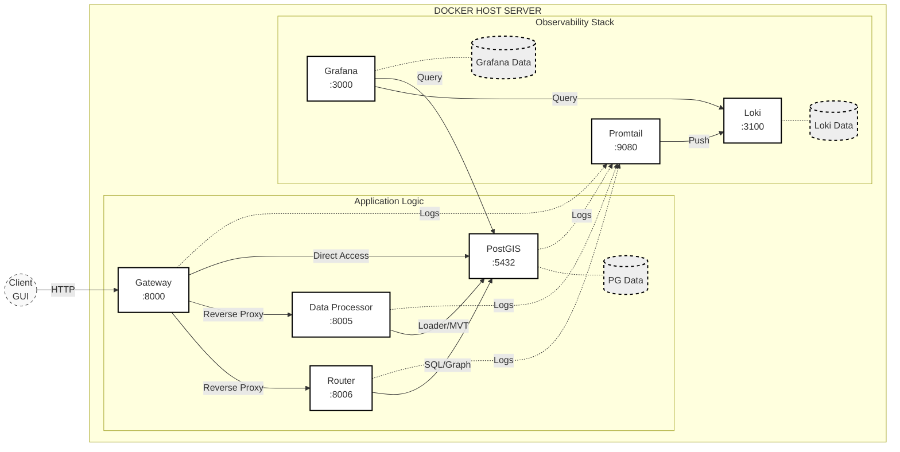
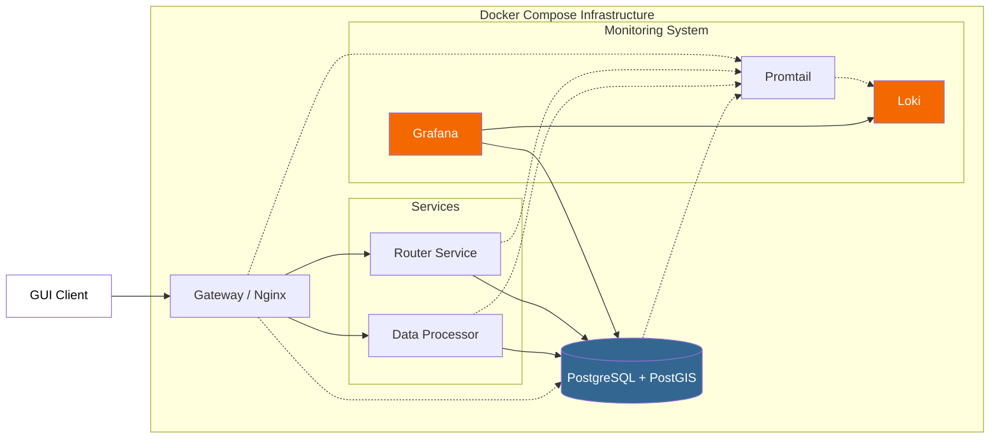
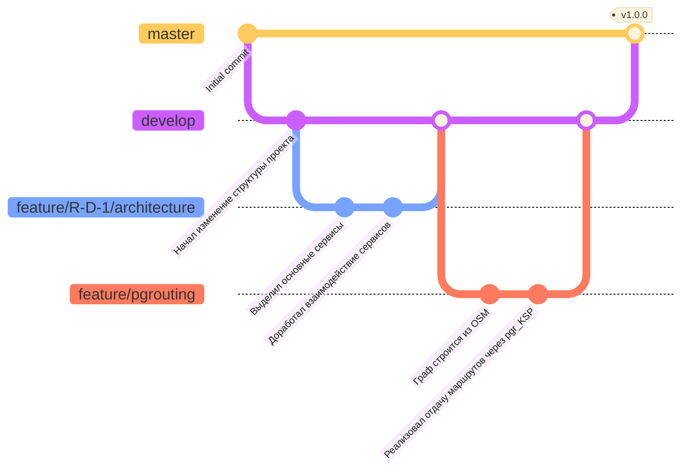

# 5 ИНФРАСТРУКТУРА РАЗРАБОТКИ И ЭКСПЛУАТАЦИИ СИСТЕМЫ

Система развёрнута на основе Docker Compose, обеспечивающего воспроизводимость окружения и изоляцию компонентов. Инфраструктура включает 5 основных сервисов: postgis (база данных), data-processor (загрузка OSM), router (маршрутизация), gateway (точка входа) и grafana (мониторинг).

## 5.1 Архитектура Docker Compose инфраструктуры

### 5.1.1 Общая схема инфраструктуры

Контейнерная архитектура системы включает 5 сервисов, организованных в общую сеть `nav-net` типа bridge. Структура развёртывания изображена на рисунке 3.


text

text


**Рисунок 3 — Архитектура Docker Compose инфраструктуры**

### 5.1.2 Конфигурация основных сервисов

**Сервис postgis** — база данных PostgreSQL с расширениями PostGIS и pgRouting

**docker-compose.yml (фрагмент)**:
```yaml
services:
  postgis:
    build:
      context: .
      dockerfile: Dockerfile.postgis
    container_name: diplom-postgis
    environment:
      POSTGRES_DB: osm
      POSTGRES_USER: diplom
      POSTGRES_PASSWORD: diplom_pass
      POSTGRES_INITDB_ARGS: "-E UTF8"
    ports:
      - "5432:5432"
    volumes:
      - postgis_data:/var/lib/postgresql/data
      - ./migrations:/docker-entrypoint-initdb.d:ro
    networks:
      - nav-net
    healthcheck:
      test: ["CMD-SHELL", "pg_isready -U diplom -d osm"]
      interval: 10s
      timeout: 5s
      retries: 5
```

Переменная окружения `POSTGRES_INITDB_ARGS: "-E UTF8"` обеспечивает кодировку UTF-8 для корректной обработки кириллических названий улиц. Каталог `migrations/` монтируется в `/docker-entrypoint-initdb.d` для автоматического выполнения SQL-скриптов инициализации при первом запуске контейнера.

Health check использует утилиту `pg_isready` для проверки готовности базы данных к приёму соединений. Параметры проверки: интервал 10 секунд, таймаут 5 секунд, 5 попыток перед признанием сервиса недоступным. Зависимые сервисы (router, data-processor) используют условие `depends_on: postgis: condition: service_healthy` для ожидания готовности БД перед запуском.

**Dockerfile.postgis**:
```dockerfile
FROM pgrouting/pgrouting:17-3.5-3.8

# Копируем скрипт автоприменения миграций
COPY docker/postgis-init.sh /usr/local/bin/apply-migrations.sh
RUN chmod +x /usr/local/bin/apply-migrations.sh

# Wrapper для запуска миграций после старта postgres
COPY docker/postgis-entrypoint.sh /usr/local/bin/custom-entrypoint.sh
RUN chmod +x /usr/local/bin/custom-entrypoint.sh

ENTRYPOINT ["/usr/local/bin/custom-entrypoint.sh"]
CMD ["postgres"]

```

Базовый образ `postgis/postgis:17-3.5` содержит PostgreSQL 17 и PostGIS 3.5. Установка пакета `postgresql-17-pgrouting` добавляет функции маршрутизации (pgr_dijkstra, pgr_KSP, pgr_trsp).

**Сервис data-processor** — загрузка OSM данных и генерация MVT тайлов

**docker-compose.yml (фрагмент)**:
```yaml
  data-processor:
    build:
      context: .
      dockerfile: services/data-processor/Dockerfile
    container_name: diplom-data-processor
    ports:
      - "8005:8005"
    environment:
      DB_HOST: postgis
      DB_PORT: 5432
      DB_NAME: osm
      DB_USER: diplom
      DB_PASSWORD: diplom_pass
    volumes:
      - ./logs/data-processor:/app/logs
      - ./configs:/app/configs:ro
    networks:
      - nav-net
    depends_on:
      postgis:
        condition: service_healthy
    restart: unless-stopped
```

Зависимость от postgis реализована через `condition: service_healthy`, гарантируя запуск data-processor только после успешного старта базы данных. Переменные окружения `DB_HOST`, `DB_PORT`, `DB_NAME`, `DB_USER`, `DB_PASSWORD` используются для подключения к PostgreSQL через asyncpg connection pool.

**services/data-processor/Dockerfile**:
```dockerfile
FROM python:3.11-slim

WORKDIR /app

COPY requirements.txt .
RUN pip install --no-cache-dir -r requirements.txt

COPY services/data-processor/src ./src
COPY src/utils ./src/utils

CMD ["python", "-m", "src.main"]
```

Использование образа `python:3.11-slim` (размер ~120 МБ против ~950 МБ полного образа) минимизирует потребление дискового пространства. Флаг `--no-cache-dir` отключает кэширование pip для уменьшения размера слоя.

**Сервис router** — построение графа и маршрутизация

**docker-compose.yml (фрагмент)**:
```yaml
  router:
    build:
      context: .
      dockerfile: services/router/Dockerfile
    container_name: diplom-router
    ports:
      - "8006:8006"
    environment:
      DB_HOST: postgis
      DB_PORT: 5432
      DB_NAME: osm
      DB_USER: diplom
      DB_PASSWORD: diplom_pass
    volumes:
      - ./logs/router:/app/logs
      - ./configs:/app/configs:ro
    networks:
      - nav-net
    depends_on:
      postgis:
        condition: service_healthy
    restart: unless-stopped
```

Router service реализует RESTful API для построения графа маршрутизации (`POST /api/v1/graph/rebuild`) и поиска маршрутов (`POST /api/v1/routing/route`). Интеграция pgRouting выполняется через прямые SQL запросы к функциям `pgr_KSP`, `pgr_dijkstra`.

**Сервис gateway** — точка входа для клиентских запросов

**docker-compose.yml (фрагмент)**:
```yaml
  gateway:
    build:
      context: .
      dockerfile: Dockerfile.gateway
    container_name: diplom-gateway
    ports:
      - "8000:8000"
    environment:
      DATA_PROCESSOR_URL: http://data-processor:8005
      ROUTER_URL: http://router:8006
    volumes:
      - ./logs/gateway:/app/logs
      - ./configs:/app/configs:ro
    networks:
      - nav-net
    depends_on:
      - data-processor
      - router
    restart: unless-stopped
```

Gateway реализует reverse proxy паттерн, маршрутизируя запросы клиентов к соответствующим микросервисам. Префикс `/tiles/*` проксируется в data-processor, префиксы `/api/v1/routing/*` и `/api/v1/graph/*` — в router. Использование внутренних DNS-имён контейнеров (`http://data-processor:8005`, `http://router:8006`) обеспечивает автоматическое разрешение адресов в Docker сети.

### 5.1.3 Observability Stack: Loki, Promtail, Grafana

**Сервис loki** — агрегация логов

**docker-compose.yml (фрагмент)**:
```yaml
  loki:
    image: grafana/loki:latest
    container_name: diplom-loki
    ports:
      - "3100:3100"
    volumes:
      - loki_data:/tmp/loki
    command: -config.file=/etc/loki/local-config.yaml
    environment:
      TZ: Europe/Moscow
    networks:
      - nav-net
```

Loki использует конфигурацию по умолчанию (`local-config.yaml`), встроенную в образ. Том `loki_data` хранит индексы и чанки логов для обеспечения персистентности.

**Сервис promtail** — доставка логов в Loki

**docker-compose.yml (фрагмент)**:
```yaml
  promtail:
    image: grafana/promtail:latest
    container_name: diplom-promtail
    volumes:
      - ./logs:/app/logs:ro
      - ./configs/promtail-config.yaml:/etc/promtail/config.yml:ro
    command: -config.file=/etc/promtail/config.yml
    depends_on:
      - loki
    networks:
      - nav-net
```

Promtail монтирует каталог `logs/` хозяина в режиме read-only (`ro`) и отслеживает изменения файлов `*.jsonl` (JSON Lines format). Конфигурация `promtail-config.yaml` определяет scrape targets для всех сервисов.

**Сервис grafana** — визуализация метрик и логов

**docker-compose.yml (фрагмент)**:
```yaml
  grafana:
    image: grafana/grafana:latest
    container_name: diplom-grafana
    ports:
      - "3000:3000"
    volumes:
      - grafana_data:/var/lib/grafana
    environment:
      GF_SECURITY_ADMIN_PASSWORD: admin
      GF_INSTALL_PLUGINS: ""
      TZ: Europe/Moscow
    depends_on:
      - loki
    networks:
      - nav-net
```

Переменная `GF_SECURITY_ADMIN_PASSWORD` устанавливает пароль администратора при первом запуске. Том `grafana_data` сохраняет настройки, дашборды и источники данных.

### 5.1.4 Сетевая конфигурация и тома

**docker-compose.yml (фрагменты)**:
```yaml
networks:
  nav-net:
    driver: bridge

volumes:
  postgis_data:
  grafana_data:
  loki_data:
```

Сеть типа `bridge` создаёт изолированную виртуальную сеть между контейнерами. Внутри сети контейнеры доступны по именам сервисов (например, `postgis`, `loki`), разрешаемым встроенным DNS-сервером Docker.

**Таблица 30 — Типы томов и их назначение**

| Том | Тип | Назначение | Персистентность |
|---|---|---|---|
| `postgis_data` | Named Volume | База данных PostgreSQL (osm, graphs) | Да |
| `grafana_data` | Named Volume | Настройки Grafana, дашборды | Да |
| `loki_data` | Named Volume | Индексы и чанки логов Loki | Да |
| `./logs` | Bind Mount | JSON Lines логи всех сервисов | Да |
| `./configs` | Bind Mount | Конфигурационные YAML файлы | Нет (read-only) |
| `./migrations` | Bind Mount | SQL скрипты инициализации БД | Нет (read-only) |

Named volumes управляются Docker и хранятся в `/var/lib/docker/volumes`. Bind mounts монтируют каталоги хозяина напрямую, обеспечивая прямой доступ к файлам (логи, конфиги).

## 5.2 Система логирования на основе Loguru

Система использует библиотеку Loguru для структурированного логирования с интеграцией в Grafana Loki для быстрого поиска и анализа проблем.

### 5.2.1 Конфигурация Loguru

**src/utils/loguru_config.py**:
```python
from loguru import logger
import sys
import os
from pathlib import Path

def configure_loguru(
    log_level: str = "INFO",
    log_to_file: bool = True,
    service_name: str = "unknown"
):
    """Configure Loguru logger with JSON formatting"""
    
    logger.remove()  # Remove default handler
    
    # Stdout handler (for Docker logs)
    logger.add(
        sys.stdout,
        level=log_level,
        format="<green>{time:YYYY-MM-DD HH:mm:ss.SSS}</green> | <level>{level: <8}</level> | {extra[service]} | {message}",
        colorize=True
    )
    
    # File handler (JSON Lines format)
    if log_to_file:
        log_dir = Path(os.getenv("LOG_DIR", "./logs"))
        log_dir.mkdir(parents=True, exist_ok=True)
        
        logger.add(
            log_dir / f"{service_name}.jsonl",
            level=log_level,
            format="{message}",
            serialize=True,  # JSON format
            rotation="100 MB",
            retention="7 days",
            compression="gz"
        )
    
    logger.configure(extra={"service": service_name})
    
    return logger
```

Параметры:
- **format** — шаблон вывода логов для stdout (цветной) и файла (JSON)
- **serialize=True** — автоматическая сериализация в JSON формат
- **rotation="100 MB"** — ротация файла при достижении 100 МБ
- **retention="7 days"** — удаление логов старше 7 дней
- **compression="gz"** — сжатие ротированных файлов

### 5.2.2 Использование Loguru в сервисах

**services/router/src/main.py** (фрагмент):
```python
from loguru import logger
from src.utils.loguru_config import configure_loguru

configure_loguru(log_level="INFO", log_to_file=True, service_name="router")

@app.on_event("startup")
async def startup():
    logger.info("router_service_starting", port=8006)
    
@app.post("/api/v1/routing/route")
async def route(request: RouteRequest):
    logger.info(
        "routing_request_received",
        start_lat=request.start_lat,
        start_lon=request.start_lon,
        end_lat=request.end_lat,
        end_lon=request.end_lon,
        k=request.k
    )
    
    result = await router_engine.find_routes(...)
    
    logger.info(
        "routing_completed",
        routes_found=len(result),
        execution_time_ms=elapsed * 1000
    )
    
    return result
```

Структурированное логирование с контекстными полями (`start_lat`, `start_lon`, `k`, `execution_time_ms`) обеспечивает возможность фильтрации и агрегации логов в Grafana Loki.

### 5.2.3 Конфигурация Promtail

**configs/promtail-config.yaml**:
```yaml
server:
  http_listen_port: 9080

positions:
  filename: /tmp/positions.yaml

clients:
  - url: http://loki:3100/loki/api/v1/push

scrape_configs:
  - job_name: docker-logs
    static_configs:
      - targets:
          - localhost
        labels:
          job: docker-logs
          __path__: /app/logs/*.jsonl

    pipeline_stages:
      - json:
          expressions:
            level: record.level.name
            service: record.extra.service
            message: record.message
            timestamp: record.time.repr
      - labels:
          level:
          service:
      - timestamp:
          source: timestamp
          format: "2024-01-15T10:30:45.123Z"
```

Pipeline stages:
1. **json** — парсинг JSON Lines формата, извлечение полей `level`, `service`, `message`, `timestamp`
2. **labels** — создание индексируемых меток `level` и `service` для быстрого поиска
3. **timestamp** — извлечение метки времени из поля `timestamp`

### 5.2.4 Запросы LogQL для анализа логов

**Пример 1: Все ошибки data-processor за последний час**
```logql
{service="data-processor"} | json | level="ERROR" | __timestamp__ > now() - 1h
```

**Пример 2: Статистика по уровням логов router**
```logql
sum by (level) (
  count_over_time({service="router"} | json [1h])
)
```

**Пример 3: Медленные запросы маршрутизации (>500 мс)**
```logql
{service="router"} | json | message="routing_completed" | execution_time_ms > 500
```

LogQL (Log Query Language) Loki использует синтаксис, схожий с PromQL, для фильтрации, агрегации и анализа логов.

## 5.3 Система конфигурации на основе YAML

### 5.3.1 Директива !include для композиции конфигураций

Система использует директиву `!include` для разделения конфигурационных файлов на независимые модули.

**configs/app.yaml**:
```yaml
database: !include db_config.yaml
api: !include api_config.yaml
performance: !include performance_config.yaml
```

**configs/db_config.yaml**:
```yaml
host: postgis
port: 5432
database: osm
user: diplom
password: diplom_pass
pool_size: 20
max_overflow: 10
```

**Реализация загрузчика с !include**:
```python
import yaml
from pathlib import Path

class IncludeLoader(yaml.SafeLoader):
    """YAML loader with !include directive support"""
    
    def __init__(self, stream):
        self._root = Path(stream.name).parent
        super().__init__(stream)

def include_constructor(loader, node):
    """Construct !include directive"""
    filename = loader.construct_scalar(node)
    filepath = loader._root / filename
    
    with open(filepath, 'r') as f:
        return yaml.load(f, IncludeLoader)

IncludeLoader.add_constructor('!include', include_constructor)

def load_config(config_path: str) -> dict:
    """Load YAML config with !include support"""
    with open(config_path, 'r') as f:
        return yaml.load(f, IncludeLoader)
```

### 5.3.2 Hot reload конфигураций

Hot reload позволяет изменять конфигурацию без перезапуска сервиса.

**src/utils/config_watcher.py**:
```python
import asyncio
from pathlib import Path
from watchdog.observers import Observer
from watchdog.events import FileSystemEventHandler

class ConfigReloader(FileSystemEventHandler):
    def __init__(self, config_path: str, reload_callback):
        self.config_path = Path(config_path)
        self.reload_callback = reload_callback
        
    def on_modified(self, event):
        if event.src_path == str(self.config_path):
            logger.info("config_file_changed", path=event.src_path)
            asyncio.create_task(self.reload_callback())

async def watch_config(config_path: str, reload_callback):
    """Watch config file for changes and reload"""
    observer = Observer()
    handler = ConfigReloader(config_path, reload_callback)
    observer.schedule(handler, str(Path(config_path).parent), recursive=False)
    observer.start()
    
    try:
        while True:
            await asyncio.sleep(1)
    except KeyboardInterrupt:
        observer.stop()
    observer.join()
```

**Интеграция в FastAPI**:
```python
from fastapi import FastAPI

app = FastAPI()

async def reload_config():
    """Reload application config"""
    global app_config
    app_config = load_config("configs/app.yaml")
    logger.info("config_reloaded", new_config=app_config)

@app.on_event("startup")
async def startup():
    asyncio.create_task(watch_config("configs/app.yaml", reload_config))
```

## 5.4 Git workflow и управление версиями

Проект использует feature branch модель разработки с автоматическим слиянием в master через pull requests. Иллюстрация того, как развивался текущий проект, на примере лишь нескольких коммитов, изображена на рисунке 4.



**Рисунок 4 — Git workflow с feature branches**

**Соглашения о коммитах**:
Все сообщения коммитов описаны в соответствии со следующим форматом:
```
<type>(<scope>): <subject>

<body>

<footer>
```

Типы коммитов:
- `feat` — новая функциональность
- `fix` — исправление ошибки
- `refactor` — рефакторинг кода
- `docs` — обновление документации
- `test` — добавление/изменение тестов
- `chore` — изменения инфраструктуры (Docker, CI/CD)

**Пример коммита**:
```
feat(routing): implement pgr_KSP for k-shortest paths

- Add pgr_KSP integration in router service
- Implement alternative routes API endpoint POST /api/v1/routing/route
- Add k parameter validation (1 <= k <= 10)

Closes #42
```

В следующем разделе представлены результаты экспериментального исследования производительности системы на реальных данных OpenStreetMap для г. Москвы.
