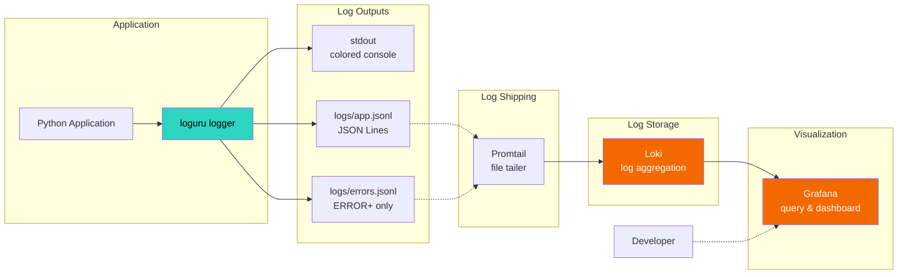

# 5 ИНФРАСТРУКТУРА РАЗРАБОТКИ И ЭКСПЛУАТАЦИИ СИСТЕМЫ

## 5.1 Контейнеризация на основе Docker Compose

Система развернута как набор изолированных микросервисов, управляемых Docker Compose. Контейнеризация обеспечивает воспроизводимость окружения, упрощает развёртывание и масштабирование компонентов системы.

### 5.1.1 Архитектура контейнерной инфраструктуры

Контейнерная архитектура системы включает 11 сервисов, организованных в общую сеть `nav-net` типа bridge. Структура развёртывания изображена на рисунке 3.

```mermaid
graph TB
    subgraph "Docker Host"
        subgraph "Persistence Layer"
            POSTGIS[postgis<br/>PostgreSQL 17 + PostGIS<br/>:5432]
            REDIS[redis<br/>Redis 7 Alpine<br/>:6379]
            PGDATA[(postgis_data<br/>Volume)]
            LOKIDATA[(loki_data<br/>Volume)]
            GRAFANADATA[(grafana_data<br/>Volume)]
            
            POSTGIS -.-> PGDATA
        end
        
        subgraph "Application Services"
            ROUTER[router<br/>FastAPI + pgRouting<br/>:8006]
            DATAPROC[data-processor<br/>OSM + MVT tiles<br/>:8005]
            TRAFFIC[traffic-manager<br/>Load tracking<br/>:8004]
            COORD[coordinator<br/>WebSocket + orchestration<br/>:8002]
            SIM[simulation<br/>Agent physics<br/>:8001]
            SERVER[server<br/>Legacy API<br/>:8000]
        end
        
        subgraph "Observability Stack"
            LOKI[loki<br/>Log aggregation<br/>:3100]
            PROMTAIL[promtail<br/>Log shipping<br/>:9080]
            GRAFANA[grafana<br/>Visualization<br/>:3000]
            
            LOKI -.-> LOKIDATA
            GRAFANA -.-> GRAFANADATA
        end
        
        subgraph "Volumes"
            LOGS[logs/<br/>Host directory]
            DATA[data/<br/>Host directory]
            CONFIGS[configs/<br/>Host directory]
        end
    end
    
    ROUTER --> POSTGIS
    DATAPROC --> POSTGIS
    TRAFFIC --> POSTGIS
    TRAFFIC --> REDIS
    SIM --> POSTGIS
    SERVER --> POSTGIS
    
    COORD --> SIM
    COORD --> ROUTER
    COORD --> TRAFFIC
    
    ROUTER -.-> LOGS
    DATAPROC -.-> LOGS
    TRAFFIC -.-> LOGS
    COORD -.-> LOGS
    SIM -.-> LOGS
    SERVER -.-> LOGS
    
    DATAPROC -.-> DATA
    SERVER -.-> DATA
    
    PROMTAIL -.-> LOGS
    PROMTAIL --> LOKI
    GRAFANA --> LOKI
    
    style POSTGIS fill:#336791,color:#fff
    style REDIS fill:#DC382D,color:#fff
    style LOKI fill:#F46800,color:#fff
    style GRAFANA fill:#F46800,color:#fff
```



**Рисунок 3 — Архитектура контейнерного развёртывания системы**

### 5.1.2 Спецификация сервисов в docker-compose.yml

**Сервис postgis** — база данных с пространственными расширениями

```yaml
postgis:
  build:
    context: .
    dockerfile: Dockerfile.postgis
  container_name: diplom-postgis
  environment:
    POSTGRES_DB: osm
    POSTGRES_USER: diplom
    POSTGRES_PASSWORD: diplom_pass
    POSTGRES_INITDB_ARGS: "-E UTF8"
  ports:
    - "5432:5432"
  volumes:
    - postgis_data:/var/lib/postgresql/data
    - ./migrations:/docker-entrypoint-initdb.d:ro
  networks:
    - nav-net
  healthcheck:
    test: ["CMD-SHELL", "pg_isready -U diplom -d osm"]
    interval: 10s
    timeout: 5s
    retries: 5
```

Переменная окружения `POSTGRES_INITDB_ARGS: "-E UTF8"` обеспечивает кодировку UTF-8 для корректной обработки кириллических названий улиц. Каталог `migrations/` монтируется в `/docker-entrypoint-initdb.d` для автоматического выполнения SQL-скриптов инициализации при первом запуске контейнера.

Health check использует утилиту `pg_isready` для проверки готовности базы данных к приёму соединений. Параметры проверки: интервал 10 секунд, таймаут 5 секунд, 5 попыток перед признанием сервиса недоступным. Зависимые сервисы (router, data-processor) используют условие `depends_on: postgis: condition: service_healthy` для ожидания готовности БД перед запуском.

**Сервис redis** — кэш для Traffic Manager

```yaml
redis:
  image: redis:7-alpine
  container_name: diplom-redis
  ports:
    - "6379:6379"
  networks:
    - nav-net
  healthcheck:
    test: ["CMD", "redis-cli", "ping"]
    interval: 10s
    timeout: 3s
    retries: 3
```

Используется образ Alpine Linux (размер ~7 МБ против ~110 МБ стандартного образа) для минимизации потребления дисковой памяти. Health check выполняет команду `redis-cli ping`, ожидая ответ `PONG` для подтверждения работоспособности.

**Сервис router** — маршрутизация с использованием pgRouting

```yaml
router:
  build:
    context: .
    dockerfile: Dockerfile.router
    cache_from:
      - diplom-router:latest
  image: diplom-router:latest
  container_name: diplom-router
  ports:
    - "8006:8006"
  environment:
    DB_HOST: postgis
    DB_PORT: 5432
    DB_NAME: osm
    DB_USER: diplom
    DB_PASSWORD: diplom_pass
  volumes:
    - ./logs/router:/app/logs
    - ./configs:/app/configs:ro
  networks:
    - nav-net
  depends_on:
    postgis:
      condition: service_healthy
  restart: unless-stopped
  develop:
    watch:
      - action: sync
        path: ./services/router/src
        target: /app/src
      - action: rebuild
        path: ./Dockerfile.router
```

Директива `cache_from: - diplom-router:latest` оптимизирует повторные сборки образа, используя кэшированные слои предыдущей сборки. Секция `develop.watch` активирует режим hot reload (Docker Compose Watch): изменения файлов в `services/router/src` автоматически синхронизируются в контейнер без пересборки образа (действие `sync`), изменения `Dockerfile.router` инициируют полную пересборку (действие `rebuild`).

Политика перезапуска `restart: unless-stopped` обеспечивает автоматический перезапуск контейнера при сбое, кроме случая явной остановки командой `docker-compose stop`.

**Сервис data-processor** — загрузка OSM и генерация MVT

```yaml
data-processor:
  build:
    context: .
    dockerfile: services/data-processor/Dockerfile
    cache_from:
      - diplom-data-processor:latest
  image: diplom-data-processor:latest
  container_name: diplom-data-processor
  ports:
    - "8005:8005"
  environment:
    POSTGRES_HOST: postgis
    POSTGRES_PORT: 5432
    POSTGRES_DB: osm
    POSTGRES_USER: diplom
    POSTGRES_PASSWORD: diplom_pass
  volumes:
    - ./logs/data-processor:/app/logs
    - ./data:/app/data
    - ./configs:/app/configs:ro
  networks:
    - nav-net
  depends_on:
    postgis:
      condition: service_healthy
  restart: unless-stopped
  develop:
    watch:
      - action: sync
        path: ./services/data-processor/src
        target: /app/src
      - action: sync
        path: ./src/utils
        target: /app/src/utils
      - action: rebuild
        path: ./services/data-processor/Dockerfile
```

Том `./data:/app/data` монтируется для сохранения загруженных данных OSM между перезапусками контейнера. Дополнительная синхронизация `./src/utils → /app/src/utils` обеспечивает hot reload общих утилит (логирование, загрузчик конфигов), используемых несколькими сервисами.

**Сервис traffic-manager** — мониторинг загрузки рёбер графа

```yaml
traffic-manager:
  build:
    context: .
    dockerfile: services/traffic-manager/Dockerfile
    cache_from:
      - diplom-traffic-manager:latest
  image: diplom-traffic-manager:latest
  container_name: diplom-traffic-manager
  ports:
    - "8004:8004"
  environment:
    POSTGRES_HOST: postgis
    POSTGRES_PORT: 5432
    POSTGRES_DB: osm
    POSTGRES_USER: diplom
    POSTGRES_PASSWORD: diplom_pass
    REDIS_HOST: redis
    REDIS_PORT: 6379
  volumes:
    - ./logs/traffic-manager:/app/logs
    - ./configs:/app/configs:ro
  networks:
    - nav-net
  depends_on:
    postgis:
      condition: service_healthy
    redis:
      condition: service_healthy
  restart: unless-stopped
```

Зависимость от двух сервисов (postgis и redis) реализована через список условий в `depends_on`. Traffic Manager использует PostgreSQL для персистентного хранения загрузки рёбер (`graphs.edges.current_load`) и Redis для высокоскоростного кэша текущего состояния сети.

**Сервис coordinator** — оркестрация и WebSocket

```yaml
coordinator:
  build:
    context: .
    dockerfile: services/coordinator/Dockerfile
    cache_from:
      - diplom-coordinator:latest
  image: diplom-coordinator:latest
  container_name: diplom-coordinator
  ports:
    - "8002:8002"
  environment:
    SIMULATION_URL: http://simulation:8001
    ROUTER_URL: http://router:8006
    TRAFFIC_URL: http://traffic-manager:8004
  volumes:
    - ./logs/coordinator:/app/logs
    - ./configs:/app/configs:ro
  networks:
    - nav-net
  depends_on:
    - simulation
    - router
  restart: unless-stopped
```

Coordinator не имеет прямого доступа к базе данных, взаимодействуя с другими сервисами через HTTP API. Переменные окружения `SIMULATION_URL`, `ROUTER_URL`, `TRAFFIC_URL` используют внутренние DNS-имена контейнеров (например, `http://simulation:8001`), разрешаемые Docker сетью `nav-net`.

**Сервис simulation** — физика движения агентов

```yaml
simulation:
  build:
    context: .
    dockerfile: services/simulation/Dockerfile
    cache_from:
      - diplom-simulation:latest
  image: diplom-simulation:latest
  container_name: diplom-simulation
  ports:
    - "8001:8001"
  environment:
    POSTGRES_HOST: postgis
    POSTGRES_PORT: 5432
    POSTGRES_DB: osm
    POSTGRES_USER: diplom
    POSTGRES_PASSWORD: diplom_pass
  volumes:
    - ./logs/simulation:/app/logs
    - ./configs:/app/configs:ro
  networks:
    - nav-net
  depends_on:
    postgis:
      condition: service_healthy
  restart: unless-stopped
```

**Сервис server** — legacy API для совместимости с GUI

```yaml
server:
  build:
    context: .
    dockerfile: Dockerfile.server
    cache_from:
      - diplom-server:latest
  image: diplom-server:latest
  container_name: diplom-server
  ports:
    - "8000:8000"
  environment:
    POSTGRES_HOST: postgis
    POSTGRES_PORT: 5432
    POSTGRES_DB: osm
    POSTGRES_USER: diplom
    POSTGRES_PASSWORD: diplom_pass
    OSM_JSON_PATH: /app/data/osm_data.json
  volumes:
    - ./data:/app/data
    - ./logs/server:/app/logs
    - ./configs:/app/configs:ro
  networks:
    - nav-net
  depends_on:
    postgis:
      condition: service_healthy
  restart: unless-stopped
```

Сервис обеспечивает обратную совместимость с GUI клиентом, использующим устаревший endpoint `/osm/fetch_road_graph`. Переменная `OSM_JSON_PATH` указывает на локальный файл данных для быстрого восстановления графа без повторной загрузки из Overpass API.

### 5.1.3 Observability Stack: Loki, Promtail, Grafana

**Сервис loki** — агрегация логов

```yaml
loki:
  image: grafana/loki:latest
  container_name: diplom-loki
  ports:
    - "3100:3100"
  volumes:
    - loki_data:/tmp/loki
  command: -config.file=/etc/loki/local-config.yaml
  environment:
    - TZ=Europe/Moscow
  networks:
    - nav-net
```

Loki использует конфигурацию по умолчанию (`local-config.yaml`), встроенную в образ. Том `loki_data` хранит индексы и чанки логов для обеспечения персистентности. Временная зона `TZ=Europe/Moscow` синхронизирует метки времени логов с местным временем.

**Сервис promtail** — доставка логов в Loki

```yaml
promtail:
  image: grafana/promtail:latest
  container_name: diplom-promtail
  volumes:
    - ./logs:/var/log/app:ro
    - ./configs/promtail-config.yaml:/etc/promtail/config.yml:ro
  command: -config.file=/etc/promtail/config.yml
  depends_on:
    - loki
  networks:
    - nav-net
```

Promtail монтирует каталог `logs/` хозяина в режиме read-only (`ro`) и отслеживает изменения файлов `*.jsonl` (JSON Lines format). Конфигурация `promtail-config.yaml` определяет scrape targets для всех сервисов.

**Сервис grafana** — визуализация логов и метрик

```yaml
grafana:
  image: grafana/grafana:latest
  container_name: diplom-grafana
  ports:
    - "3000:3000"
  environment:
    - GF_SECURITY_ADMIN_PASSWORD=admin
    - GF_USERS_ALLOW_SIGN_UP=false
  volumes:
    - grafana_data:/var/lib/grafana
  depends_on:
    - loki
  networks:
    - nav-net
```

Переменная `GF_SECURITY_ADMIN_PASSWORD=admin` устанавливает пароль администратора (учётные данные по умолчанию: `admin`/`admin`). `GF_USERS_ALLOW_SIGN_UP=false` отключает самостоятельную регистрацию пользователей для предотвращения несанкционированного доступа.

### 5.1.4 Сетевая конфигурация и тома

**Сеть nav-net**

```yaml
networks:
  nav-net:
    driver: bridge
```

Сеть типа `bridge` создаёт изолированную виртуальную сеть между контейнерами. Внутри сети контейнеры доступны по именам сервисов (например, `postgis`, `redis`, `loki`), разрешаемым встроенным DNS-сервером Docker.

**Персистентные тома**

```yaml
volumes:
  postgis_data:
    driver: local
  loki_data:
    driver: local
  grafana_data:
    driver: local
```

Именованные тома (`named volumes`) управляются Docker и сохраняются при удалении контейнеров. Расположение томов на хосте: `/var/lib/docker/volumes/<volume_name>/_data`.

Таблица 11 обобщает конфигурацию томов и монтирований.

**Таблица 11 — Конфигурация томов Docker Compose**

| Том/Монтирование | Тип | Назначение | Персистентность |
|---|---|---|---|
| `postgis_data` | Named Volume | Данные PostgreSQL | Да |
| `loki_data` | Named Volume | Индексы и чанки логов Loki | Да |
| `grafana_data` | Named Volume | Настройки и дашборды Grafana | Да |
| `./logs:/app/logs` | Bind Mount | Логи приложений (JSON Lines) | Да (хост) |
| `./data:/app/data` | Bind Mount | Загруженные данные OSM | Да (хост) |
| `./configs:/app/configs:ro` | Bind Mount | YAML конфигурации (read-only) | Да (хост) |

Bind mounts (`./logs`, `./data`, `./configs`) позволяют прямой доступ к файлам на хосте для редактирования конфигов и анализа логов без входа в контейнер.

### 5.1.5 Пример Dockerfile сервиса

Dockerfile сервиса router (файл `Dockerfile.router`):

```dockerfile
FROM python:3.11-slim

WORKDIR /app

# Оптимизация кэша pip с использованием BuildKit mount cache
COPY requirements.txt .
RUN --mount=type=cache,target=/root/.cache/pip \
    pip install --no-compile -r requirements.txt

# Копирование исходного кода
COPY services/router/src/ ./src/
COPY src/utils ./src/utils
COPY configs/ ./configs/

EXPOSE 8006

CMD ["python3", "-m", "src.main"]
```

Директива `RUN --mount=type=cache,target=/root/.cache/pip` использует BuildKit mount cache для ускорения повторных сборок: загруженные пакеты pip кэшируются между сборками, снижая время установки зависимостей с ~60 секунд до ~5 секунд.

Флаг `--no-compile` отключает предварительную компиляцию .pyc файлов, экономя ~15% времени установки и ~10 МБ места в образе (компиляция происходит при первом импорте модуля в runtime).

Dockerfile сервиса server (файл `Dockerfile.server`):

```dockerfile
FROM python:3.11-slim

WORKDIR /app

COPY requirements.txt .
RUN --mount=type=cache,target=/root/.cache/pip \
    pip install --no-compile -r requirements.txt

COPY src/ ./src/
COPY configs/ ./configs/
COPY db/ ./db/

EXPOSE 8000

CMD ["python3", "-m", "src.server.main"]
```

Структура Dockerfile идентична для всех сервисов, различаются только копируемые каталоги и точка входа (`CMD`).

## 5.2 Система логирования на основе Loguru и Grafana Loki

Система использует библиотеку Loguru для zero-cost структурированного логирования с интеграцией в Grafana Loki для быстрого поиска и анализа проблем.

### 5.2.1 Архитектура логирования

Конвейер обработки логов изображён на рисунке 4.



**Рисунок 4 — Конвейер обработки логов системы**

### 5.2.2 Конфигурация Loguru

Функция `configure_loguru()` (файл `src/utils/loguru_config.py`) настраивает логирование для всех сервисов:

```python
def configure_loguru(
    service_name: str = "service",
    log_level: str = "DEBUG",
    log_to_file: bool = True,
    stdout: bool = True
) -> None:
    """
    Configure loguru with common format for all services.
    
    Args:
        service_name: Service name for log files
        log_level: Log level (DEBUG/INFO/WARNING/ERROR)
        log_to_file: Enable file logging
        stdout: Enable stdout logging
    """
    # Remove default handler
    _logger.remove()
    
    # Map levels to single-letter icons
    def format_record(record):
        level_map = {
            "TRACE": "T",
            "DEBUG": "D",
            "INFO": "I",
            "SUCCESS": "I",
            "WARNING": "W",
            "ERROR": "E",
            "CRITICAL": "F"
        }
        record["extra"]["level_icon"] = level_map.get(
            record["level"].name, record["level"].name[0]
        )
        return record
    
    log_format = (
        "[<green>{time:YYYY.MM.DD HH:mm:ss.SSS}</green>] "
        "{{<cyan>{thread.id:x}</cyan>}} "
        "<level>{extra[level_icon]}</level> "
        "<level>{message}</level>"
    )
    
    _logger.configure(patcher=format_record)
    
    # Stdout handler
    if stdout:
        _logger.add(
            sys.stdout,
            format=log_format,
            level=log_level,
            colorize=True,
            backtrace=True,
            diagnose=True
        )
    
    # File handler
    if log_to_file:
        _logger.add(
            f"logs/{service_name}.log",
            format=log_format,
            level=log_level,
            rotation="10 MB",
            retention="7 days",
            compression="zip",
            backtrace=True,
            diagnose=True
        )
    
    _logger.info(f"Loguru configured for {service_name}")
```

**Формат лога**: `[YYYY.MM.DD HH:mm:ss.SSS] {thread_id} LEVEL Message`

Пример вывода:
```
[2025.12.20 14:32:15.234] {7f4a} I Router service started on port 8006
[2025.12.20 14:32:16.891] {7f4a} D Connecting to database postgis:5432
[2025.12.20 14:32:17.002] {7f4a} I Database connection established
```

**Параметры конфигурации**:
- `colorize=True` — цветной вывод в консоль (зелёный для времени, голубой для thread ID, цвет уровня логирования)
- `backtrace=True` — полный стек вызовов при ошибках
- `diagnose=True` — подсветка значений переменных в стек-трейсе
- `rotation="10 MB"` — ротация файла при достижении 10 МБ
- `retention="7 days"` — удаление логов старше 7 дней
- `compression="zip"` — сжатие ротированных файлов

**Уровни логирования**:
- **TRACE** (5) — вход/выход каждой функции (декораторы)
- **DEBUG** (10) — детали выполнения, промежуточные результаты
- **INFO** (20) — важные события (стандартно включен)
- **SUCCESS** (25) — успешные завершения операций
- **WARNING** (30) — предупреждения
- **ERROR** (40) — ошибки
- **CRITICAL** (50) — критичные ошибки

### 5.2.3 Структурированное логирование

Loguru поддерживает структурированное логирование с автоматической сериализацией контекста:

```python
from loguru import logger

# Простое логирование
logger.info("Processing started", batch_size=100)

# Структурированное логирование с контекстом
logger.debug("Algorithm selected", algorithm="v2.1", version="2.1.3")

# Логирование ошибок с полным стек-трейсом
try:
    risky_operation()
except Exception as e:
    logger.exception("Operation failed", operation="risky")
```

Вывод в JSON Lines format (`logs/app.jsonl`):

```json
{"text": "Processing started", "record": {"message": "Processing started", "level": {"name": "INFO"}, "time": {"repr": "2025-12-20T14:32:15.234+03:00"}, "function": "process_batch", "module": "processor", "extra": {"batch_size": 100}}}
{"text": "Algorithm selected", "record": {"message": "Algorithm selected", "level": {"name": "DEBUG"}, "time": {"repr": "2025-12-20T14:32:16.123+03:00"}, "function": "select_algorithm", "extra": {"algorithm": "v2.1", "version": "2.1.3"}}}
```

### 5.2.4 Конфигурация Promtail для доставки логов

Promtail отслеживает файлы логов и отправляет их в Loki. Конфигурация (файл `configs/promtail-config.yaml`) определяет scrape jobs для каждого сервиса:

```yaml
server:
  http_listen_port: 9080
  grpc_listen_port: 0

positions:
  filename: /tmp/positions.yaml

clients:
  - url: http://loki:3100/loki/api/v1/push

scrape_configs:
  # Router service logs
  - job_name: router_logs
    static_configs:
      - targets:
          - localhost
        labels:
          job: router_logs
          application: navigation_mas
          container: router
          environment: development
          __path__: /var/log/app/router/app.jsonl
    
    pipeline_stages:
      # Parse loguru serialize=True format: {text, record}
      - json:
          expressions:
            level: record.level.name
            logger: record.name
            message: record.message
            function: record.function
            line: record.line
            module: record.module
            timestamp: record.time.repr
            thread_id: record.extra.thread_id
      
      # Extract labels for Loki indexing
      - labels:
          level:
          logger:
          function:
          container:
      
      # Set timestamp from log entry
      - timestamp:
          source: timestamp
          format: RFC3339Nano
```

**Pipeline stages**:
1. **json** — парсинг JSON Lines формата Loguru, извлечение полей `record.level.name`, `record.message`, `record.function`, `record.extra.*`
2. **labels** — добавление меток Loki для индексации (level, logger, function, container)
3. **timestamp** — установка временной метки из поля `record.time.repr` (формат RFC3339Nano)

Аналогичные scrape jobs настроены для всех сервисов: `server_logs`, `data-processor_logs`, `traffic-manager_logs`, etc.

### 5.2.5 Поиск логов в Grafana с использованием LogQL

LogQL — язык запросов Loki, синтаксис похож на PromQL (Prometheus Query Language). Примеры запросов:

**Все логи приложения**:
```logql
{job="router_logs"}
```

**Только ошибки**:
```logql
{job="router_logs"} | json | level="ERROR"
```

**Ошибки за последний час**:
```logql
{job="router_logs"} | json | level="ERROR" and timestamp > now() - 1h
```

**Логи конкретной функции**:
```logql
{job="router_logs"} | json | function="calculate_route"
```

**Комбинированный запрос с фильтрацией и форматированием**:
```logql
{job="router_logs"} 
  | json 
  | level="ERROR" 
  | function=~"process.*"
  | line_format "{{.timestamp}} [{{.level}}] {{.function}}: {{.message}}"
```

**Агрегация: количество ошибок в минуту**:
```logql
rate({job=~".*_logs"} | json | level="ERROR" [1m])
```

**Агрегация: среднее время выполнения по функциям**:
```logql
avg_over_time(
  {job="router_logs"} | json | duration_ms > 0 | unwrap duration_ms [5m]
) by (function)
```

### 5.2.6 Дашборды Grafana для мониторинга

Рекомендуемые панели для dashboard в Grafana:

**Panel 1: Errors per minute by service**
```logql
sum(rate({job=~".*_logs"} | json | level="ERROR" [1m])) by (container)
```

Визуализация: Time series graph, тип: Lines, заполнение под линией 50% opacity.

**Panel 2: Top 10 slowest functions (last 5 min)**
```logql
topk(10, 
  avg_over_time(
    {job=~".*_logs"} | json | duration_ms > 0 | unwrap duration_ms [5m]
  ) by (function)
)
```

Визуализация: Bar chart, сортировка по убыванию.

**Panel 3: Log volume by level**
```logql
sum(count_over_time({job=~".*_logs"} | json [1m])) by (level)
```

Визуализация: Time series, тип: Stacked bars.

**Panel 4: Recent errors (последние 50 записей)**
```logql
{job=~".*_logs"} | json | level="ERROR"
```

Визуализация: Logs, сортировка по времени DESC.

## 5.3 Система конфигурации на основе YAML с поддержкой директивы !include

Все параметры системы вынесены в YAML-файлы, хранящиеся в каталоге `configs/`. Поддержка директивы `!include` позволяет композицию конфигураций из отдельных модулей для повторного использования и упрощения сопровождения.

### 5.3.1 Структура каталога конфигураций

```
configs/
├── common.yaml               # Общие настройки для всех сервисов
├── promtail-config.yaml      # Конфигурация Promtail
├── client/                   # Конфигурации GUI клиента
│   ├── gui.yaml              # Параметры окна, темы
│   ├── map.yaml              # Карта (включает map.lod.yaml + map.rendering.yaml)
│   ├── map.lod.yaml          # LOD (Level of Detail) для векторной карты
│   ├── map.rendering.yaml    # Стили рендеринга дорог
│   ├── simulation.yaml       # Физика агентов, FPS
│   ├── data.yaml             # Источники данных OSM
│   └── debug.yaml            # Флаги отладки
├── server/                   # Конфигурации backend сервисов
│   ├── api.yaml              # Настройки FastAPI
│   ├── database.yaml         # Параметры подключения к PostGIS
│   └── routing.yaml          # Алгоритмы маршрутизации
├── router/                   # Конфигурации router service
│   ├── car_profile.yaml      # Профиль автомобиля (скорости, штрафы)
│   └── traffic_config.yaml   # Параметры BPR функции, capacity
├── data-processor/           # Конфигурации data-processor service
│   ├── bboxes.yaml           # Предопределённые области загрузки
│   └── overpass.yaml         # Настройки Overpass API
└── simulation/               # Конфигурации simulation service
    ├── agent_physics.yaml    # Физические параметры агентов
    └── simulation.yaml       # Параметры симуляции
```

### 5.3.2 Директива !include для композиции конфигов

Файл `configs/client/map.yaml`:

```yaml
# Map Configuration
# Complete configuration for MapLibre GL map client

# LOD (Level of Detail) layers - 4-layer progressive system
lod: !include map.lod.yaml

# Rendering configuration - colors, widths, highway groups
rendering: !include map.rendering.yaml

# Initial map view settings
initial:
  center: [37.6173, 55.7558]  # Moscow center [lon, lat]
  zoom: 12
  minZoom: 0
  maxZoom: 19

# Background color
background_color: '#f3f4f6'  # Light gray
```

Директива `!include` рекурсивно загружает и встраивает содержимое указанного файла. Результат парсинга эквивалентен следующему монолитному файлу:

```yaml
lod:
  layers:
    - name: highways
      minzoom: 0
      maxzoom: 6
      highways: [motorway, trunk]
      # ... полное содержимое map.lod.yaml
rendering:
  colors:
    motorway: '#e34341'
    trunk: '#fbb03b'
    # ... полное содержимое map.rendering.yaml
initial:
  center: [37.6173, 55.7558]
  zoom: 12
  # ...
```

### 5.3.3 Конфигурация LOD (Level of Detail) системы

Файл `configs/client/map.lod.yaml` определяет 4-слойную систему прогрессивной детализации карты:

```yaml
# LOD (Level of Detail) Configuration
# 4-layer progressive detail system for map rendering

layers:
  - name: highways
    minzoom: 0
    maxzoom: 6
    highways:
      - motorway
      - motorway_link
      - trunk
      - trunk_link
    show_names: false
    show_refs: true    # Highway refs (M-11, A-107)
    show_lanes: false
    show_maxspeed: false
    show_surface: false
    base_width: 0.5
  
  - name: major_roads
    minzoom: 6
    maxzoom: 8
    highways:
      - motorway
      - motorway_link
      - trunk
      - trunk_link
      - primary
      - primary_link
    show_names: false
    show_refs: true
    show_lanes: false
    show_maxspeed: false
    show_surface: false
    base_width: 1.5
  
  - name: arterial_roads
    minzoom: 8
    maxzoom: 10
    highways:
      - motorway
      - motorway_link
      - trunk
      - trunk_link
      - primary
      - primary_link
      - secondary
      - secondary_link
      - tertiary
      - tertiary_link
      - residential
      - living_street
      - unclassified
      - service
    show_names: true   # Show street names
    show_refs: true
    show_lanes: true   # Show lane count
    show_maxspeed: false
    show_surface: false
    base_width: 2.0
  
  - name: all_roads
    minzoom: 10
    maxzoom: 24
    highways:
      - motorway
      - motorway_link
      - trunk
      - trunk_link
      - primary
      - primary_link
      - secondary
      - secondary_link
      - tertiary
      - tertiary_link
      - residential
      - living_street
      - unclassified
      - service
    show_names: true
    show_refs: true
    show_lanes: true
    show_maxspeed: true   # Show speed limit
    show_surface: true    # Road surface (asphalt/concrete)
    base_width: 2.5
```

Таблица 12 суммирует конфигурацию LOD слоёв.

**Таблица 12 — Конфигурация LOD слоёв векторной карты**

| Слой | Zoom range | Highway types | Show names | Show lanes | Base width | Назначение |
|---|---|---|---|---|---|---|
| highways | 0-6 | motorway, trunk | Нет | Нет | 0.5 | Обзорная карта: только магистрали |
| major_roads | 6-8 | + primary | Нет | Нет | 1.5 | Добавлены дороги первого класса |
| arterial_roads | 8-10 | + secondary, tertiary, residential, service | Да | Да | 2.0 | Городские артерии: появляются названия и полосы |
| all_roads | 10-24 | Все типы | Да | Да | 2.5 | Детальная карта: скорость, покрытие |

LOD система снижает объём передаваемых данных MVT тайлов на низких масштабах: на zoom=5 размер тайла ~2 КБ (только магистрали), на zoom=14 размер тайла ~15 КБ (все дороги).

### 5.3.4 Общая конфигурация system-wide параметров

Файл `configs/common.yaml`:

```yaml
# Common Configuration
# Shared settings for all services (client + server)

# API endpoints (used by client to connect to server)
api:
  base_url: ${API_BASE_URL:http://server:8000}
  
  endpoints:
    routes: "/routes"
    nearest: "/nearest"
    osm_load: "/osm/load"
    osm_fetch_graph: "/osm/fetch_road_graph"
    osm_cache_region: "/osm/cache_region"
    osm_regions: "/osm/regions"
    osm_fetch_tile: "/osm/fetch_tile"
    tiles_roads_mvt: "/tiles/roads/{z}/{x}/{y}.pbf"
    tiles_osm_raster: "/tiles/osm/{z}/{x}/{y}.png"
    simulation_step: "/simulation/step"
    simulation_state: "/simulation/state"
    simulation_create_agent: "/simulation/create_agent"
    simulation_update_agent: "/simulation/update_agent"
    simulation_delete_agent: "/simulation/delete_agent"

# Default timeouts (seconds)
timeouts:
  default: 30
  graph_fetch: 600      # Large bbox downloads
  route_calculation: 60
  tile_fetch: 10

# Logging configuration
logging:
  format: "json"
  level: ${LOG_LEVEL:INFO}
  console: true
  file: true
  log_dir: "logs"
  rotation: "100 MB"
  retention: "7 days"
```

Переменные окружения поддерживаются через синтаксис `${VAR_NAME:default_value}`:
- `${API_BASE_URL:http://server:8000}` — использует переменную окружения `API_BASE_URL`, если установлена, иначе значение по умолчанию `http://server:8000`
- `${LOG_LEVEL:INFO}` — уровень логирования из переменной `LOG_LEVEL`, по умолчанию `INFO`

### 5.3.5 Hot Reload конфигураций

Изменения конфигурационных файлов применяются после перезапуска сервиса без пересборки Docker образа:

```bash
# Редактируем конфиг
nano configs/router/traffic_config.yaml

# Перезапускаем только router service
docker-compose restart router
```

Время перезапуска сервиса: ~2-5 секунд (загрузка Python интерпретатора + подключение к БД).

Альтернативно, при использовании Docker Compose Watch (секция `develop.watch`), изменения конфигов автоматически синхронизируются в контейнер, но требуют явного перезапуска процесса приложения внутри контейнера или внедрения механизма hot reload на уровне приложения (например, watchdog для Python).

## 5.4 Git workflow и практики разработки

Разработка системы велась с использованием Git для контроля версий и организации совместной работы (хотя проект выполнялся одним разработчиком, Git workflow обеспечил структурированность истории изменений).

### 5.4.1 Структура репозитория

Репозиторий организован как монорепозиторий (monorepo), содержащий все компоненты системы в едином Git репозитории:

```
diplom/
├── .git/
├── .gitignore
├── README.md
├── docker-compose.yml
├── Dockerfile.server
├── Dockerfile.router
├── Dockerfile.postgis
├── requirements.txt
├── src/                      # Общий исходный код
│   ├── client/               # GUI клиент
│   ├── server/               # Legacy server
│   ├── data/                 # OSM loader, graph builder
│   ├── routing/              # Routing engines
│   ├── simulation/           # Agent physics
│   └── utils/                # Общие утилиты (loguru_config, config_loader)
├── services/                 # Микросервисы (каждый с отдельным Dockerfile)
│   ├── router/
│   ├── data-processor/
│   ├── traffic-manager/
│   ├── coordinator/
│   └── simulation/
├── configs/                  # YAML конфигурации
├── logs/                     # Логи приложений (игнорируется .gitignore)
├── data/                     # Данные OSM (игнорируется .gitignore)
├── docs/                     # Документация
├── tests/                    # Тесты
└── REPORTS/                  # Отчёты НИР
```

### 5.4.2 Конвенция коммитов

Коммиты следуют конвенции Conventional Commits с префиксами типа изменения:

- `feat:` — новая функциональность
- `fix:` — исправление ошибки
- `refactor:` — рефакторинг без изменения функциональности
- `perf:` — оптимизация производительности
- `docs:` — изменения документации
- `test:` — добавление или изменение тестов
- `chore:` — изменения инфраструктуры (docker, configs)
- `style:` — форматирование кода, отступы

Примеры коммитов:

```
feat(router): add k-shortest paths calculation with pgr_KSP
fix(data-processor): fix ST_DWithin tolerance for node detection
refactor(client): extract map event handlers into separate module
perf(server): optimize MVT tile generation with spatial index
docs: add LOGGING.md with Grafana integration guide
chore(docker): add hot reload with Docker Compose Watch
```

Формат: `<тип>(<область>): <описание>`, где область опциональна и указывает затронутый компонент (router, client, server, docker).

### 5.4.3 Feature Branch Workflow

Разработка новых функций выполнялась в отдельных ветках с последующим слиянием в `main`:

1. **Создание feature ветки** от актуального `main`:
   ```bash
   git checkout main
   git pull origin main
   git checkout -b feature/pgr-ksp-integration
   ```

2. **Разработка и коммиты** в feature ветку:
   ```bash
   git add services/router/src/routing/pgr_ksp.py
   git commit -m "feat(router): implement pgr_KSP k-shortest paths"
   
   git add tests/test_routing.py
   git commit -m "test(router): add tests for pgr_KSP"
   ```

3. **Локальное тестирование** функциональности:
   ```bash
   docker-compose up --build router
   pytest tests/test_routing.py
   ```

4. **Слияние в main** после завершения разработки:
   ```bash
   git checkout main
   git merge feature/pgr-ksp-integration
   git push origin main
   ```

5. **Удаление feature ветки**:
   ```bash
   git branch -d feature/pgr-ksp-integration
   ```

Альтернативный подход — использование Pull Requests (PR) в GitHub/GitLab для code review перед слиянием, но в рамках индивидуальной разработки слияние выполнялось напрямую.

### 5.4.4 .gitignore конфигурация

Файл `.gitignore` исключает из версионного контроля временные файлы, логи, данные и виртуальные окружения:

```gitignore
# Python
__pycache__/
*.py[cod]
*.so
*.egg
*.egg-info/
dist/
build/
venv/
.venv/

# IDE
.vscode/
.idea/
*.swp
*.swo

# Logs
logs/
*.log
*.jsonl

# Data
data/
*.json
*.osm
*.pbf

# Docker
.docker/

# OS
.DS_Store
Thumbs.db

# Temp
tmp/
temp/
*.tmp
```

Исключение логов (`logs/`) и данных (`data/`) из репозитория снижает размер репозитория (данные OSM для moscow_mkad занимают ~500 МБ, логи за неделю ~100 МБ).

### 5.4.5 Версионирование и теги

Релизы системы помечаются семантическими версиями (Semantic Versioning):

```bash
git tag -a v1.0.0 -m "Release 1.0.0: базовая маршрутизация и MVT tiles"
git push origin v1.0.0

git tag -a v1.1.0 -m "Release 1.1.0: интеграция pgr_KSP и Grafana"
git push origin v1.1.0
```

Формат версии: `MAJOR.MINOR.PATCH`
- MAJOR — несовместимые изменения API
- MINOR — новая функциональность с обратной совместимостью
- PATCH — исправления ошибок

## 5.5 Практики развёртывания и управления средой

### 5.5.1 Запуск системы с нуля

**Шаг 1: Клонирование репозитория**
```bash
git clone https://github.com/username/diplom.git
cd diplom
```

**Шаг 2: Создание каталогов для данных**
```bash
mkdir -p logs data configs
```

**Шаг 3: Запуск всех сервисов**
```bash
docker-compose up --build -d
```

Флаг `--build` пересобирает образы, `-d` (detached) запускает контейнеры в фоновом режиме.

**Шаг 4: Проверка статуса сервисов**
```bash
docker-compose ps
```

Вывод:
```
NAME                   STATUS                PORTS
diplom-postgis         Up 45 seconds         0.0.0.0:5432->5432/tcp
diplom-redis           Up 45 seconds         0.0.0.0:6379->6379/tcp
diplom-router          Up 30 seconds         0.0.0.0:8006->8006/tcp
diplom-data-processor  Up 30 seconds         0.0.0.0:8005->8005/tcp
diplom-grafana         Up 30 seconds         0.0.0.0:3000->3000/tcp
...
```

**Шаг 5: Загрузка данных OSM**
```bash
curl -X POST http://localhost:8005/api/v1/tiles/redownload \
  -H "Content-Type: application/json" \
  -d '{"bbox_name": "moscow_center"}'
```

**Шаг 6: Построение графа маршрутизации**
```bash
curl -X POST http://localhost:8006/api/v1/graph/rebuild
```

**Шаг 7: Доступ к Grafana**
```
http://localhost:3000
Логин: admin
Пароль: admin
```

### 5.5.2 Обновление сервиса без простоя

Обновление отдельного сервиса без остановки всей системы:

```bash
# Пересобрать образ router
docker-compose build router

# Пересоздать контейнер router (старый контейнер останавливается)
docker-compose up -d --no-deps router
```

Флаг `--no-deps` предотвращает перезапуск зависимых сервисов (например, postgis).

Время простоя сервиса: ~2-5 секунд (остановка старого контейнера + запуск нового).

### 5.5.3 Просмотр логов сервисов

**Логи всех сервисов в режиме реального времени**:
```bash
docker-compose logs -f
```

**Логи конкретного сервиса**:
```bash
docker-compose logs -f router
```

**Последние 100 строк логов**:
```bash
docker-compose logs --tail=100 router
```

**Логи с временными метками**:
```bash
docker-compose logs -t router
```

### 5.5.4 Очистка данных и перезапуск с чистого листа

**Остановка и удаление всех контейнеров**:
```bash
docker-compose down
```

**Удаление томов (PostgreSQL data, Loki data, Grafana data)**:
```bash
docker-compose down -v
```

**Удаление образов**:
```bash
docker-compose down --rmi all
```

**Очистка логов на хосте**:
```bash
rm -rf logs/*
```

**Полная пересборка и запуск**:
```bash
docker-compose down -v --rmi all
rm -rf logs/* data/*
docker-compose up --build -d
```

### 5.5.5 Масштабирование сервисов

Docker Compose поддерживает запуск нескольких экземпляров сервиса (горизонтальное масштабирование):

```bash
docker-compose up -d --scale router=3
```

Запустит 3 экземпляра сервиса router на портах 8006, 8007, 8008 (требуется настройка load balancer для распределения запросов).

В текущей конфигурации масштабирование не используется, так как все сервисы имеют фиксированные порты в `docker-compose.yml`. Для поддержки масштабирования требуется:
1. Удалить явное проброс портов (`ports:`) для масштабируемых сервисов
2. Добавить nginx или traefik как reverse proxy
3. Настроить service discovery (внутренний DNS Docker поддерживает round-robin для нескольких контейнеров одного сервиса)

### 5.5.6 Мониторинг ресурсов контейнеров

**Использование CPU и памяти**:
```bash
docker stats
```

Вывод:
```
CONTAINER ID   NAME                   CPU %     MEM USAGE / LIMIT     MEM %
a3c2b1d4e5f6   diplom-postgis         12.34%    256.5MiB / 2GiB      12.5%
b4d3c2e1f0a5   diplom-router          5.67%     128.3MiB / 1GiB      12.5%
c5e4d3f2a1b6   diplom-grafana         2.34%     64.2MiB / 512MiB     12.5%
...
```

**Дисковое пространство томов**:
```bash
docker system df -v
```

**Удаление неиспользуемых образов, контейнеров, сетей**:
```bash
docker system prune -a
```

Флаг `-a` удаляет все неиспользуемые образы, не только dangling (без тега).

В следующем разделе представлены результаты тестирования системы, экспериментальные данные по производительности маршрутизации и анализ выявленных проблем.
