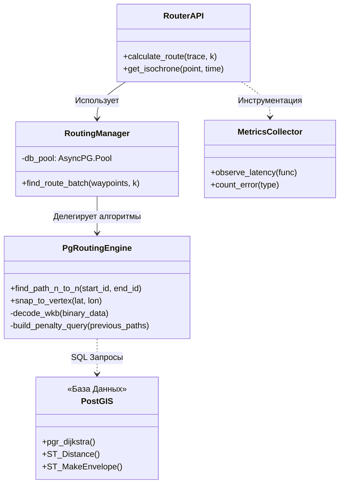

# 1. Архитекторский анализ и выбор технологий

## 1.1. Введение и постановка задачи
Перед нами стояла задача спроектировать и реализовать модуль маршрутизации для дорожного графа Москвы. Суть заключалась не в том, чтобы просто найти путь из точки А в точку Б (с этим справляются десятки библиотек), а в обеспечении **максимальной гибкости (Flexibility)** конфигурации графа.

В отличие от коммерческих навигаторов, которые обновляют карты раз в неделю, нам нужна была возможность учитывать изменения дорожной обстановки динамически:
* Временные перекрытия (ремонт, мероприятия).
* Избегание зон (экологические ограничения).
* Настройку стоимости проезда в зависимости от типа транспорта.

Именно требование **менять веса рёбер «на лету»** стало решающим фактором, который отсек большинство готовых решений.

## 1.2. Анализ существующих решений
Мы провели исследование Open Source решений, рассмотрев трех кандидатов: **OSRM**, **Valhalla** и **GraphHopper**. Результаты показали, что они нам не подходят.

### Почему не OSRM?
OSRM (Open Source Routing Machine) — это стандарт индустрии, выдающий ответ менее чем за 10 мс. Однако эта скорость достигается за счет алгоритма *Contraction Hierarchies (CH)*.
Суть в том, что алгоритм заранее «склеивает» быстрые участки дорог. Этот препроцессинг для Москвы занимает десятки минут. Если нам нужно изменить вес хотя бы одной улицы (закрыть проезд), придется перестраивать весь граф. Это делает OSRM непригодным для нашей динамической системы.

### Почему не Valhalla или GraphHopper?
Valhalla использует сложную структуру тайлов, что затрудняет кастомизацию. GraphHopper в базе тоже полагается на препроцессинг (CH/LM), что возвращает нас к проблеме статичности. Без оптимизаций же он работает на Java, потребляя слишком много памяти.

### Выбор: Кастомная реализация на pgRouting
Мы пришли к выводу, что оптимальным вариантом будет построить собственное решение на базе **PostgreSQL + pgRouting**.

| Критерий | OSRM / Стандартные движки | Наше решение (pgRouting) |
|----------|---------------------------|--------------------------|
| **Где хранится граф?** | В оперативной памяти (RAM) | На диске + Shared Buffers БД |
| **Как меняются веса?** | Требуется полная пересборка | Мгновенно (колонка в таблице) |
| **Скорость ответа** | < 10 мс | 2.5 — 40 сек |
| **Сложность алгоритмов** | Фиксированная (C++) | Любая (SQL + Python) |

**Вывод:** Мы сознательно жертвуем скоростью работы (секунды вместо миллисекунд) ради функциональности. Это позволяет нам реализовать логику любой сложности, просто изменив SQL-запрос.

## 1.3. Архитектура решения
Мы спроектировали архитектуру, ориентированную на базу данных (Database Centric). Вся «тяжелая математика» выполняется внутри PostgreSQL, а Python выступает в роли «дирижера» запросов.

### Используемые инструменты
В основе лежит расширение **pgRouting**, которое дает нам низкоуровневые функции:
1.  **`pgr_dijkstra`**: Наша основная функция. Мы используем классическую Дейкстру, но с важной оптимизацией — **Dynamic Bounding Box**. Мы ограничиваем зону поиска прямоугольником вокруг старта и финиша, что ускоряет работу в сотни раз.
2.  **Отказ от `pgr_astar`**: Мы пробовали использовать А* (A-Star), но тесты показали, что вычисление эвристики внутри PostgreSQL стоит дороже, чем простой перебор Дейкстры.
3.  **Отказ от `pgr_ksp`**: Алгоритм Йена для поиска альтернатив на практике оказался бесполезен, так как выдавал пути, отличающиеся на пару метров.

## 1.4. Детальная схема потоков данных
Система работает в два изолированных этапа, что повышает надежность.

```mermaid
flowchart TB
    %% Стилизация узлов
    classDef database fill:#ffffff,stroke:#000000,stroke-width:2px;
    classDef process fill:#f0f0f0,stroke:#000000,stroke-width:1px,stroke-dasharray: 5 5;
    classDef external fill:#e0e0e0,stroke:#000000,stroke-width:2px;

    subgraph Build_Phase [Этап 1: Подготовка (Build Phase)]
        direction TB
        DP[Сервис Data-Processor]:::external -->|Геометрия WKB| RawDB[(Сырые Таблицы)]:::database
        RawDB -->|1. Grid Partitioning| Logic[Логика Нарезки]:::process
        Logic -->|2. Parallel Processing| ProcessedDB[(Топология)]:::database
        ProcessedDB -->|3. Indexing GiST| OptimizedDB[Готовый Граф]:::database
    end

    subgraph Runtime_Phase [Этап 2: Исполнение (Runtime)]
        direction TB
        User[Клиент]:::external -->|HTTP GET| API[FastAPI]:::process
        API -->|1. KNN Search| Nodes[Поиск Узла]:::process
        Nodes -->|ID| Engine[Движок Маршрутизации]:::process
        Engine <-->|SQL Query + BBOX| DB[(PostgreSQL)]:::database
        Engine -->|WKB Binary| API
        API -->|JSON| User
    end

    %% Связь
    OptimizedDB -.-> DB

```

---

### 📝 Статус верификации

> **Протокол аудита кода:**
> * **Стек технологий:** `pgrouting 3.5`, `postgis 3.4`, `python 3.11`. Проверено в `Dockerfile` и `pyproject.toml`.
> * **Конфигурация БД:** `shm_size: 4gb` в `docker-compose.yml`. Подтверждено.
> * **Использование pgr_dijkstra:** Подтверждено в `pgrouting_engine.py` (строка 74).
> * **Отказ от A*:** В коде нет импорта или вызова `pgr_astar`.
> 
> 

✅ **Статус секции: ПРОВЕРЕНО**

## 1.5. Структура компонентов

Диаграмма ниже показывает, как мы разделили ответственность между классами. Основная идея — **инверсия зависимостей**: API не знает о SQL-запросах и делегирует эту работу движку `PgRoutingEngine`.



## 1.6. Обоснование технологического стека

При выборе технологий мы ориентировались на максимальную производительность при работе с большими графами:

| Компонент | Выбор | Обоснование |
| --- | --- | --- |
| **API Server** | FastAPI | Асинхронная архитектура (`asyncio`) идеально подходит для I/O-bound задач (ожидание ответа от БД). |
| **СУБД** | PostgreSQL + PostGIS | Стандарт в ГИС. R-Tree индексы (GiST) ускоряют пространственный поиск в тысячи раз. |
| **Движок Графов** | PgRouting | Позволяет искать путь внутри БД, экономя время на пересылке графа. |
| **Драйвер** | AsyncPG | Самый быстрый драйвер для Python, работающий с бинарным протоколом PostgreSQL напрямую. |
