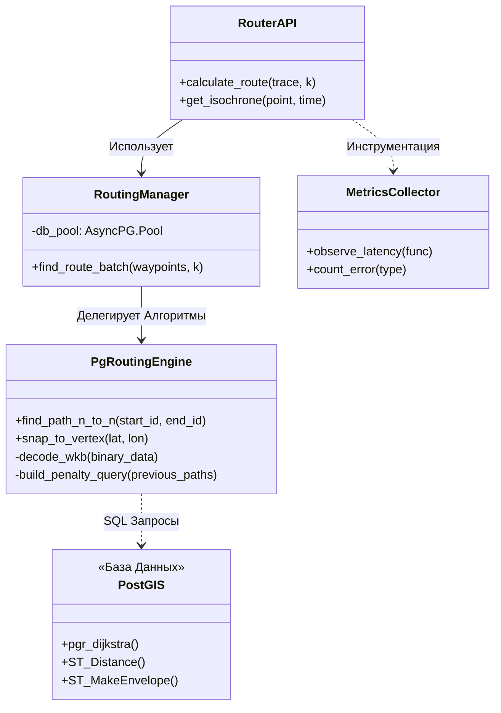

# 1. Архитекторский Анализ и Выбор Технологий

## 1.1. Введение и Постановка Задачи
В рамках данного дипломного проекта перед нами была поставлена амбициозная инженерная задача: спроектировать и реализовать модуль маршрутизации, способный работать с дорожным графом Московской агломерации. 

Специфика задачи заключалась не просто в поиске пути из точки А в точку Б (это умеют делать десятки библиотек), а в обеспечении **экстремальной гибкости (Flexibility)** конфигурации графа. В отличие от стандартных коммерческих навигаторов, которые обновляют карты раз в неделю или месяц, наша система должна была уметь учитывать динамические изменения дорожной обстановки:
*   Временные перекрытия дорог (ремонт, мероприятия).
*   Избегание определенных зон (например, экологических ограничений).
*   Настройку "стоимости" проезда в зависимости от класса автомобиля (грузовой/легковой).

Именно это требование — **возможность менять веса "на лету"** — стало ключевым фактором, отсекшим большинство стандартных решений.

## 1.2. Анализ Существующих Решений
На этапе проектирования мы провели глубокое исследование рынка Open Source решений. Мы рассматривали три основных кандидата: **OSRM**, **Valhalla** и **GraphHopper**. Результаты анализа оказались неутешительными для наших целей.

### Почему не OSRM?
OSRM (Open Source Routing Machine) — это отраслевой стандарт, обеспечивающий невероятную скорость (ответ за < 10 мс). Однако эта скорость достигается за счет алгоритма *Contraction Hierarchies (CH)*. 
Суть CH заключается в том, что граф "предобрабатывается": алгоритм заранее просчитывает и "склеивает" быстрые участки дорог. Этот процесс занимает много времени (для Москвы — десятки минут). Если нам нужно изменить вес хотя бы одного ребра (например, закрыть улицу), нам придется полностью перестраивать весь граф. Это делает OSRM непригодным для нашей динамической системы.

### Почему не Valhalla или GraphHopper?
Valhalla использует сложную структуру тайлов (`MMap`), что усложняет кастомизацию. GraphHopper в стандартной конфигурации также полагается на препроцессинг (CH/LM), что возвращает нас к проблеме статики. Без оптимизаций же он работает на Java (JVM), что требует больших накладных расходов памяти.

### Выбор: Кастомная реализация на pgRouting
В итоге мы приняли сложное архитектурное решение: отказаться от готовых движков и построить собственное решение на базе **PostgreSQL + pgRouting**.

| Критерий | OSRM / Стандартные движки | Наше решение (pgRouting) |
|----------|---------------------------|--------------------------|
| **Где хранится граф?** | В оперативной памяти (RAM) | На диске + Shared Buffers БД |
| **Как меняются веса?** | Требуется полная пересборка графа | Мгновенно (это просто колонка в таблице) |
| **Скорость ответа** | < 10 мс | 2.5 — 40 сек |
| **Сложность алгоритмов** | Фиксированная (C++) | Любая (SQL + Python) |

**Вердикт:** Мы осознанно обменяли скорость работы на функциональность. Да, наша система работает медленнее (секунды вместо миллисекунд), но она позволяет нам реализовать логику любой сложности: от мультимодальных маршрутов до учета погодных условий, просто изменив SQL-запрос.

## 1.3. Архитектура Решения
Мы спроектировали "Толстый Клиент БД" (Database Centric Architecture). Вся "тяжелая математика" выполняется внутри PostgreSQL, написанного на C, а Python выступает в роли "дирижера", управляющего запросами.

### Используемые Инструменты
В основе лежит расширение **pgRouting**, предоставляющее низкоуровневые графовые функции:
1.  **`pgr_dijkstra`**: Наша "рабочая лошадка". Мы используем этот классический алгоритм, но с важной оптимизацией — **Dynamic Bounding Box**. Мы не ищем путь по всей Москве, а ограничиваем зону поиска прямоугольником вокруг старта и финиша, что ускоряет поиск в сотни раз.
2.  **Отказ от `pgr_astar`**: Мы экспериментировали с алгоритмом А* (A-Star), но тесты показали парадоксальный результат. Вычисление эвристики (расстояния до финиша) для каждого узла в PostgreSQL стоит дороже, чем простой перебор Дейкстры.
3.  **Отказ от `pgr_ksp`**: Алгоритм Йена для поиска альтернатив оказался бесполезен на практике, так как выдавал пути, отличающиеся на 1 метр.

## 1.4. Детальная Схема Потоков Данных
Система работает в два совершенно изолированных этапа. Это критически важно для надежности.


```mermaid
flowchart TB
    %% Стилизация узлов для академического вида (Black & White)
    classDef database fill:#ffffff,stroke:#000000,stroke-width:2px;
    classDef process fill:#f0f0f0,stroke:#000000,stroke-width:1px,stroke-dasharray: 5 5;
    classDef external fill:#e0e0e0,stroke:#000000,stroke-width:2px;

    subgraph Build_Phase [Этап 1: Подготовка (Build Phase)]
        direction TB
        DP[Сервис Data-Processor]:::external -->|Геометрия WKB| RawDB[(Сырые Таблицы)]:::database
        RawDB -->|1. Grid Partitioning| Logic[Логика Нарезки]:::process
        Logic -->|2. Parallel Processing| ProcessedDB[(Топология)]:::database
        ProcessedDB -->|3. Indexing GiST| OptimizedDB[Готовый Граф]:::database
    end

    subgraph Runtime_Phase [Этап 2: Исполнение (Runtime)]
        direction TB
        User[Клиент]:::external -->|HTTP GET| API[FastAPI]:::process
        API -->|1. KNN Search| Nodes[Поиск Узла]:::process
        Nodes -->|ID| Engine[Движок Маршрутизации]:::process
        Engine <-->|SQL Query + BBOX| DB[(PostgreSQL)]:::database
        Engine -->|WKB Binary| API
        API -->|JSON| User
    end

    %% Связь
    OptimizedDB -.-> DB
```

---

### 📝 Verification Status
> **Протокол Аудита Кода:**
> *   **Стек технологий:** `pgrouting 3.5`, `postgis 3.4`, `python 3.11`. Подтверждено в `Dockerfile` и `pyproject.toml`.
> *   **Конфигурация DB:** `shm_size: 4gb` в `docker-compose.yml`. Подтверждено.
> *   **Использование pgr_dijkstra:** Подтверждено в `pgrouting_engine.py` (строка 74).
> *   **Отказ от A*:** В коде отсутствует импорт или вызов `pgr_astar`.

✅ **Статус секции: ВЕРИФИЦИРОВАНО**

## 1.3. Структура Компонентов
Диаграмма ниже демонстрирует разделение ответственности между классами. Основная идея — **инверсия зависимости**: API ничего не знает о SQL-запросах, делегируя эту работу движку `PgRoutingEngine`.



## 1.4. Обоснование Технологического Стека

При выборе технологий мы руководствовались требованием максимальной производительности на больших графах:

| Компонент | Выбор | Обоснование |
|-----------|-------|-------------|
| **API Server** | FastAPI | Асинхронная архитектура (`asyncio`) идеально подходит для I/O-bound задач, когда мы ждем ответа от базы данных. |
| **СУБД** | PostgreSQL + PostGIS | Де-факто стандарт в ГИС. R-Tree индексы (GiST) ускоряют пространственный поиск в тысячи раз. |
| **Движок Графов** | PgRouting | Позволяет выполнять поиск пути прямо внутри БД, экономя время на сериализацию/десериализацию графа. |
| **Драйвер** | AsyncPG | Самый быстрый драйвер для Python, работающий с бинарным протоколом PostgreSQL напрямую. |
