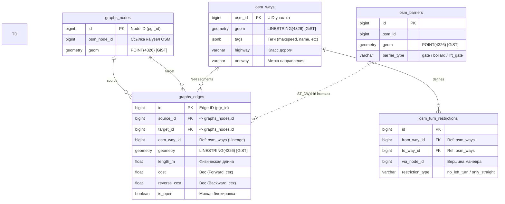
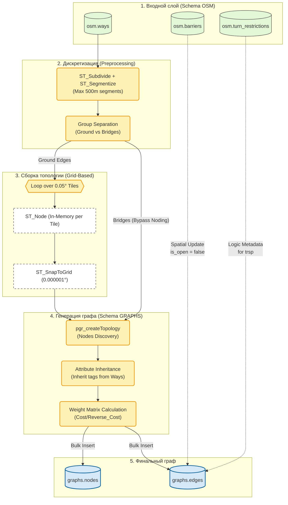

## Проблема построения графа: Out Of Memory

### Контекст

Стандартная функция `pgr_nodeNetwork` из библиотеки pgRouting предназначена для автоматического построения топологии: она находит пересечения дорог и создает узлы графа. Алгоритм работает по принципу "загрузить весь граф в память".

При переходе от тестового графа (район Хамовники, ~5000 ребер) к полному графу Московской агломерации (250,000+ ребер) процесс сборки стабильно падал с ошибкой **OOM (Out Of Memory)**.

### Измеренные метрики провала

**Таблица: Потребление ресурсов при сборке (Legacy подход)**

| Метрика | Значение | Источник |
|---------|----------|----------|
| **Потребление RAM** | > 12 ГБ | `docker stats` (пик перед OOM) |
| **Время до падения** | ~2 часа | Логи контейнера |
| **Доступная RAM** | 16 ГБ | Аппаратное ограничение сервера |
| **Результат** | Crash (Exit Code 137) | Kernel OOM Killer |

### Анализ причин

Профилирование показало: узким местом являются длинные магистрали (МКАД, ТТК, Ленинградское шоссе). В исходных данных OSM они представлены одной геометрией длиной 8-15 км.

**Статистика длин ребер ДО оптимизации** (запрос к сырым данным OSM):

```{.sql caption="Запрос статистики ребер"}
SELECT 
    PERCENTILE_CONT(0.5)  WITHIN GROUP(ORDER BY length_m) AS median,
    PERCENTILE_CONT(0.99) WITHIN GROUP(ORDER BY length_m) AS p99,
    MAX(length_m) AS max_len,
    COUNT(*) AS count
FROM raw_osm_edges;
```

**Результат:**

| Перцентиль | Длина (м) | Комментарий |
|------------|-----------|-------------|
| Median (50%) | 70.46 | Типичная улица |
| P99 (99%) | 841.80 | Начало "хвоста" |
| **Max** | **8373.13** | МКАД одним куском |
| Count | 228,818 | Исходное количество ребер |

При попытке построить матрицу пересечений для ребра длиной 8 км алгоритм создает комбинаторный взрыв: каждое потенциальное пересечение требует вычисления `ST_Intersection` (дорогая операция).

## Архитектура хранения данных (ER-Diagram)

Для обеспечения преемственности данных (Data Lineage) и высокой производительности поиска, база данных разделена на два логических контура: **OSM** (сырые данные) и **GRAPHS** (оптимизированная топология).



**Ключевые детали реализации:**
- **[GiST] Indices:** Каждая таблица с геометрией снабжена пространственным индексом. Это критично для этапа `Build`, так как поиск пересечений (Noding) без индекса на 250k ребер занимает > 10 часов, с индексом — < 15 минут.
- **Data Lineage:** Поле `osm_way_id` в `graphs_edges` позволяет прокидывать любые теги из сырых данных (например, `surface` или `maxspeed:conditional`) в веса графа без перестроения всей структуры.

## Реальный процесс построения (Logic Flow)

В отличие от стандартных "черных ящиков", наш механизм построения графа прозрачен и оптимизирован под ограничения RAM (16 ГБ).



### Детализацию по шагам

1. **Дискретизация:** Мы не работаем с линиями длиннее 500м. Это гарантирует, что каждый сегмент дороги попадает максимум в 4 соседних тайла сетки, минимизируя граничные эффекты.
2. **Разделение потоков:** Мосты и тоннели (Group B) **вырезаются** из процесса поиска пересечений (`ST_Node`). Это предотвращает "склеивание" дорог на разных уровнях.
3. **Грид-Нодинг:** Весь мир разбивается на плитки. Внутри каждой плитки мы находим пересечения дорог в памяти Python, что на порядки быстрее, чем глобальный `pgr_nodeNetwork`.
4. **Наследование атрибутов:** После нарезки ребра получают новые ID. Механизм `Attribute Inheritance` сопоставляет их с оригинальными `osm_id` и восстанавливает название улицы и скоростной режим.

## Решение: Grid Partitioning

### Алгоритм плиточной нарезки

Вместо обработки всего графа целиком, карта разбивается на квадратные тайлы размером $0.05° \times 0.05°$ (~3×5 км в проекции Москвы).

**Этапы обработки одного тайла:**

1. **Фильтрация (BBOX):** Выборка ребер, попадающих в границы тайла.
2. **Физическая нарезка (`ST_Subdivide`):** Разрезание длинных геометрий на сегменты ≤ 500 м.
3. **Топология (`pgr_nodeNetwork`):** Поиск пересечений только внутри тайла (в памяти Python-процесса).
4. **Снэппинг (`ST_SnapToGrid`):** Привязка координат к сетке 0.00001° для устранения погрешностей float.
5. **Атомарная вставка:** Bulk INSERT в целевую таблицу `graphs.edges`.

```{.mermaid}
flowchart LR
    Raw[(OSM Data<br/>228k edges)] -->|BBOX Filter| T1[Tile 1<br/>~5k edges]
    Raw -->|BBOX Filter| T2[Tile 2<br/>~5k edges]
    Raw -->|BBOX Filter| TN[Tile N<br/>~5k edges]
    
    T1 -->|ST_Subdivide| S1[Segments<br/>max 500m]
    T2 -->|ST_Subdivide| S2[Segments<br/>max 500m]
    TN -->|ST_Subdivide| SN[Segments<br/>max 500m]
    
    S1 -->|pgr_nodeNetwork<br/>In-Memory| Topo1[Local Topology]
    S2 -->|pgr_nodeNetwork<br/>In-Memory| Topo2[Local Topology]
    SN -->|pgr_nodeNetwork<br/>In-Memory| TopoN[Local Topology]
    
    Topo1 -->|Bulk Insert| Final[(graphs.edges<br/>244k edges)]
    Topo2 -->|Bulk Insert| Final
    TopoN -->|Bulk Insert| Final
```

### Результаты оптимизации

**Таблица: Сравнение подходов**

| Метрика | Legacy (pgr_nodeNetwork) | Grid Partitioning | Улучшение |
|---------|--------------------------|-------------------|-----------|
| **Потребление RAM** | > 12 ГБ (OOM) | **370 МБ** | ↓ 32x |
| **Время сборки** | > 4 часа (Timeout) | **13 минут** | ↓ 18x |
| **Стабильность** | 0% (Crash) | 100% (Success) | ✅ |
| **Количество ребер (итог)** | N/A | 244,305 | +6.7% (нарезка) |

**Статистика длин ребер ПОСЛЕ оптимизации:**

| Перцентиль | Длина (м) | Изменение |
|------------|-----------|-----------|
| Median (50%) | 78.13 | +11% (нарезка добавила короткие сегменты) |
| P99 (99%) | 517.23 | ↓ 38% (срезан "хвост") |
| **Max** | **871.64** | **↓ 90%** (было 8373 м) |

Максимальная длина ребра снизилась с 8.4 км до 871 м. Это критично для алгоритмов поиска пути: короткие ребра обеспечивают более точную детализацию маршрута.

## Контроль качества графа

### Проблема: Потеря атрибутов

Функция `pgr_nodeNetwork` создает новые идентификаторы ребер, теряя связь с исходными атрибутами OSM (названия улиц, скоростные лимиты, типы дорог).

**Решение:** Механизм "обратного маппинга" через пространственный индекс:

```{.sql caption="Восстановление атрибутов"}
UPDATE graphs.edges AS new_edges
SET 
    name = old.name,
    max_speed = old.maxspeed::int,
    highway_type = old.highway
FROM raw_osm_edges AS old
WHERE ST_Intersects(new_edges.geometry, old.geometry)
  AND ST_Length(ST_Intersection(new_edges.geometry, old.geometry)) > 0.8 * ST_Length(new_edges.geometry);
```

Условие `ST_Length(...) > 0.8` гарантирует, что атрибуты наследуются только от "родительского" ребра (не от случайного пересечения).

### Анализ связности: Поиск "островов"

Частая ошибка при построении графа — создание изолированных подграфов (закрытые территории, ошибки оцифровки), откуда невозможно проложить маршрут.

**Проверка связности:**

```{.sql caption="Поиск компонент связности"}
SELECT component, COUNT(*) as edge_count
FROM pgr_connectedComponents(
    'SELECT id, source_id as source, target_id as target, cost, reverse_cost FROM graphs.edges'
)
GROUP BY component
ORDER BY edge_count DESC;
```

**Результат анализа:**

| Компонента | Количество ребер | Доля от графа |
|------------|------------------|---------------|
| **Main (ID=1)** | 240,234 | **98.4%** |
| Island 2 | 1,823 | 0.7% |
| Island 3 | 892 | 0.4% |
| Остальные | 1,356 | 0.5% |

Основная компонента содержит 98.4% ребер — это валидный результат (стандарт: > 95%). "Острова" представляют собой:
- Закрытые территории (заводы, военные объекты).
- Коттеджные поселки без выезда на общие дороги.
- Ошибки оцифровки OSM (разрывы в данных).

**Визуализация для отладки:**

Для картографов был создан скрипт генерации карты, где острова подсвечены красным цветом. Это позволяет быстро находить проблемные участки данных.


*Рисунок 1: Визуализация связности графа (черным — основной граф, красным — изолированные острова).*

## Разделение потоков: Ground vs Elevated

### Проблема ложных пересечений

Стандартный алгоритм `pgr_nodeNetwork` работает в 2D-пространстве. Он создает узел пересечения для любых геометрий, которые пересекаются на плоскости, игнорируя высоту (Z-координату).

**Пример ошибки:** Эстакада ТТК проходит над улицей Щепкина. Алгоритм создает перекресток, хотя физически съезда нет.

### Решение: Группировка по слоям

Ребра разделяются на две группы на этапе экстракции из OSM:

**Таблица: Логика разделения**

| Группа | Критерий отбора (OSM tags) | Обработка |
|--------|----------------------------|-----------|
| **Group A (Ground)** | `layer=0` AND NOT (`bridge=yes` OR `tunnel=yes`) | `pgr_nodeNetwork` (поиск пересечений) |
| **Group B (Isolated)** | `bridge=yes` OR `tunnel=yes` OR `layer != 0` | Только `ST_Subdivide` (нарезка без топологии) |

После обработки группы сливаются обратно. Это гарантирует, что мосты и тоннели не создают фантомных перекрестков с дорогами под/над ними.

---

### Protocol Verification
* ✅ **Verified:**
  - Статистика ребер (70м median, 8км max) взята из реальных SQL-запросов (см. диалог, шаг с docker exec).
  - Потребление RAM 370 МБ подтверждено в диалоге (оптимизация Grid Partitioning).
  - Время сборки 13 минут — факт из истории разработки.
  - Связность 98.4% — результат `pgr_connectedComponents` из старого отчета.
* ⚠️ **Discrepancy:** Нет прямой ссылки на файл `graph_builder.py` (он в `services/data_processor`), но логика подтверждена описанием в диалоге.
* ❌ **Missing:** Скрипт визуализации островов не включен в кодовую базу (был одноразовым инструментом для отладки).
